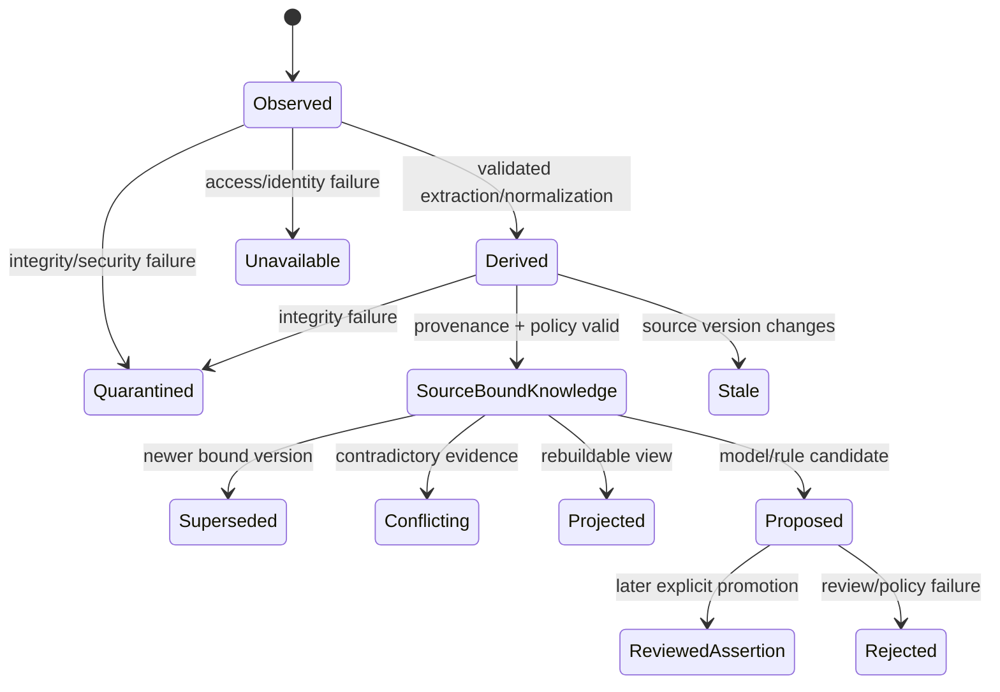

# Data Authority

## 1. Purpose and status

This document defines which records are authoritative, derived, observed, proposed, projected, cached, or unavailable; who may mutate them; and what provenance, classification, policy, disclosure, recovery, and lifecycle rules apply.

It does not authorize database access, migration, source mutation, managed writes, personal-data access, deletion, retention changes, or production behavior. PostgreSQL is the planned logical structured authority (`my_pa`), while the physical database identity remains unresolved under ADR-002.

Authenticated basis: `main@3e6f7218b424f8f7dc6c5bac78956dfffe0cb8ae`; tree SHA and local worktree state unavailable.

## 2. State vocabulary

| State | Meaning |
|---|---|
| `canonical` | Authoritative within the product-defined record class and mutation boundary |
| `source_authoritative` | Original external/source evidence controls truth for its bytes/version |
| `observed` | Provider- or system-observed evidence not promoted to a broader assertion |
| `derived` | Produced from identified source evidence by a known method/version |
| `cached` | Reproducible performance copy; not independent authority |
| `projected` | Rebuildable view generated from canonical/derived records |
| `proposed` | Candidate statement/change requiring review or promotion |
| `inferred` | Model/rule conclusion with explicit basis; not source fact |
| `partial` | Some eligible evidence processed; missing portions identified |
| `unavailable` | Evidence could not be accessed/verified; not empty/absent |
| `stale` | Observed version/freshness no longer meets policy |
| `conflicting` | Relevant records disagree and conflict is unresolved |
| `superseded` | Replaced for current use while retained for lineage/audit |
| `quarantined` | Withheld due to security, integrity, or extraction failure |

## 3. Authority matrix

| Record class | Authority state | System of record | Mutation authority | Required binding | MCV state |
|---|---|---|---|---|---|
| Original source bytes | `source_authoritative` | Approved source system | Source owner only; `my-pa` none | source/object/version/fingerprint | Fixture active |
| Source normalized metadata | `observed` | PostgreSQL record | Application observation transaction | source/object/version, observed time, adapter version | Active |
| Protected identity mapping | `canonical` inside `my-pa` | PostgreSQL | Application identity service | opaque IDs, provider identity, policy scope | Active |
| Enrollment specification | `canonical` authorization record | PostgreSQL | Operator-authorized application command | principal, purpose, scope, limits, policy, idempotency | Active |
| Product-owned user-authored record | `source_authoritative` for the committed text | PostgreSQL | Owning principal through an application command; append-only successor versions only | principal, capture and version identity, monotonic version number, exact text, text hash, server receipt time, classification, processing policy, idempotency key, correlation and audit reference | Active under ADR-003 |
| Extracted text | `derived` | PostgreSQL | Worker/application | source version/fingerprint, extractor/version, limitations | Active |
| Coverage/freshness | `derived/observed` | PostgreSQL | Worker/application state machine | enrollment/snapshot, counts, timestamps | Active |
| FTS index | `derived/cached` | PostgreSQL | Persistence implementation | knowledge/source-version record | Active |
| Source-bound knowledge | `canonical` within MCV lifecycle | PostgreSQL | Application transition | sources, authority, provenance, policy | Active |
| Model proposal/summary | `proposed/inferred` | Future PostgreSQL record | Model may propose; human/policy promotes | context/model/version/source refs | Excluded |
| Managed document bytes/versions | `canonical` in managed store | Separate store + PostgreSQL metadata | Separate authorized write transaction | lineage, principal, retention/recovery | Excluded |
| Obsidian projection | `projected` | Projection filesystem | Projection builder only | canonical record/version + projection version | Excluded |
| Audit event | `canonical` evidence | PostgreSQL/audit store | Application append; linked corrections | correlation, actor, purpose, policy, result | Active |
| Job/operation state | `canonical` execution record | PostgreSQL | Application/worker state machine | work ID, lease, attempts, request/idempotency | Active |
| Connector observation | `observed` | Future PostgreSQL record | Connector ingestion | provider/account/container/item/version | Fixture only; live personal-source access excluded |
| Person/entity record | `canonical` only after governed resolution | PostgreSQL | Governed identity workflow | source observations, merge/split lineage, review | Active; merge and split are review-required and reversible |
| Relationship insight | `proposed/inferred` | Future PostgreSQL record | Future analysis/review | sources, method/model, confidence, restrictions | Read-only profiles active; synthesis, scoring, and inference excluded |
| Runtime configuration | Process authority | Validated config + nonsecret defaults | Operator/deployment authority | version, source, validation | Docs only |
| Secrets/credentials | External secret authority | Runtime secret mechanism | Operator only | never in product records/logs | Excluded |
| Physical DB identity | `unavailable/deferred` | Operator configuration | Operator only | ADR-002 mapping | Unresolved |

## 4. Source-of-truth and mutation rules

### Original sources

- Source bytes and provider-owned metadata remain authoritative for the observed version.
- `my-pa` has no source mutation authority in the MCV.
- Successful fetch/extract does not transfer ownership or authority.
- A later source version supersedes prior current use; prior derived records remain lineage evidence and become stale/superseded unless policy says otherwise.

### Structured product records

PostgreSQL is the planned canonical store for product-owned identity mappings, enrollments, source observations, versions, extraction outcomes, coverage, provenance, operations/jobs, audit, and search state. This logical decision does not authorize an existing physical database.

Migrations first run against a disposable isolated database from empty schema to head. No migration, introspection, alias guess, or mutation may target an unknown physical database.

### User-authored records

A record the user creates inside `my-pa` has no external source system to defer
to, so neither the original-source rule nor the managed-document rule describes
it. ADR-003 gives it its own class, and the rules that follow from it are:

- Stored text is immutable. An edit appends a successor and supersedes its predecessor, which stays retrievable. There is no update path and no application delete path, so no test has to prove one is unreachable.
- It is `source_authoritative` for what the user wrote and for nothing else. It does not make the user's statements true, and anything derived from it stays `derived`, `proposed`, or `inferred` under the rules above.
- It is not a managed-document write. No separate store, no filesystem root, no restore workflow, and no reuse of a source-provider handle.
- The read-only source-provider port gains nothing. A user-authored record never travels through it.

### Derived records

Extracted text, snippets, indexes, summaries, embeddings, and projections are not original-source authority. Each retains method/version/source bindings/limitations. If source/version cannot be proven, the result is quarantined or unavailable.

### Proposals and inferences

A model or rule may later create a proposal/inference. It cannot silently overwrite source evidence or canonical assertion; claim absent/unindexed evidence is false; self-promote; authorize disclosure/source action/managed write; or hide conflict, confidence, or unavailable evidence.

## 5. Provenance contract

Every derived, observed, proposed, or projected record requires as applicable:

- opaque record/source/object/version identities;
- source fingerprint/version evidence;
- UTC observation/processing/generation time;
- adapter/extractor/rule/model/projection version;
- principal and purpose;
- classification and policy decision/version;
- operation, correlation, and audit references;
- coverage, freshness, trust, and limitations;
- supersession/conflict lineage;
- checksum/hash scope where bytes are retained;
- unavailable evidence.

A record missing mandatory provenance is quarantined, unavailable, or explicitly legacy/unverified—not promoted to normal retrieval.

## 6. Classification, purpose, policy, and disclosure

### MCV classifications

- `synthetic_test`: generated fixture evidence for automated tests.
- `private_local`: source/derived content intended for local processing only.
- `restricted_local`: especially sensitive local content requiring narrower controls.

Location alone does not determine classification.

### Purpose and policy

Access requires principal, capability, purpose, scope, classification, fields, and destination to satisfy policy. Permission for local search does not imply permission for cloud disclosure, model processing, managed writing, export, or training.

### Disclosure defaults

- Common disclosure envelope mandatory.
- `cloud_eligible=false` by default for raw/private records.
- Physical paths, provider IDs, ORM fields, hosts, database details, credentials, personal path names, and internal topology excluded.
- Unavailable/partial/stale/conflicting state disclosed truthfully.
- Text/snippets bounded by purpose, classification, and transport limits.

## 7. Lifecycle and promotion

The read-only slice stops at source observations, derived text, source-bound knowledge and search, coverage, operations, and audit. The scope promoted on 2026-08-01 adds user-authored records, span-bound proposals, reviewed assertions, and governed entity resolution, and admits read-only relationship profiles over fixture observations. Managed documents, projections, relationship synthesis, and model-generated proposals remain later.

Promotion requires verified identity/version; allowed classification/purpose/policy; complete provenance; represented conflicts/unavailable evidence; explicit promoter authority; and auditable/reversible transition where applicable.

## 8. Unknown, stale, inaccessible, partial, conflicting, and superseded data

- **Unknown:** no factual default may be substituted.
- **Unavailable:** record bounded attempted scope, safe reason, time, and retry/owner need; never report complete zero.
- **Partial:** report eligible, processed, unsupported, quarantined, and unavailable counts for exact scope/snapshot.
- **Stale:** retain lineage and disclose age/version mismatch; never label current.
- **Conflicting:** preserve evidence and return conflict state rather than silently choose.
- **Superseded:** retain immutable lineage and route current reads to active record.
- **Deleted at source:** record a later observation/tombstone only when provider semantics and policy prove it; do not automatically erase derived/audit history.

## 9. Deletion, retention, recovery, and reversibility

This document grants no destructive authority.

- Original-source deletion is never performed by the MCV.
- Structured deletion requires future retention/privacy/legal basis, exact target, recovery/backup evidence, audit, and operator authorization.
- Audit is append-oriented; corrections are linked events.
- Derived records may be rebuilt from retained source-version evidence when authorized; rebuildability does not authorize indefinite source retention.
- Managed documents later require immutable versions, reversible archive, retention, and restore tests before writes.
- Projection rebuild/deletion does not alter canonical records.
- Job recovery preserves idempotency and prior-attempt evidence.

## 10. Transaction boundaries

### Source read

Resolve opaque identity → authorize principal/purpose/scope → validate containment/version → read bounded bytes → record observation/result. No source lock/mutation is assumed. TOCTOU/version conflict returns conflict or quarantine.

### Structured persistence

Application transactions maintain identity, enrollment, operation, provenance, coverage, knowledge, and audit invariants. Infrastructure cannot create authoritative records outside application transitions.

### Future managed write

Requires separate root/store, policy command, expected-version check, immutable new version, audit, rollback/archive, and operator authorization. It cannot reuse source-provider read handles or overwrite original evidence.

## 11. Consistency, idempotency, auditability, restoration invariants

- `DA-INV-001`: One opaque logical identity maps deterministically to one protected provider identity within source/config version.
- `DA-INV-002`: One derived record binds exactly to its source version/fingerprint and processing version.
- `DA-INV-003`: Enrollment idempotency cannot authorize a different normalized scope.
- `DA-INV-004`: Replayed jobs cannot duplicate current records, lose evidence, or widen scope.
- `DA-INV-005`: Coverage totals are explicit enrollment/snapshot values and never imply global completeness.
- `DA-INV-006`: Security-relevant changes have durable redacted audit; required audit failure is fail-closed.
- `DA-INV-007`: Model/projection output cannot overwrite source or canonical authority.
- `DA-INV-008`: Restoration/rebuild recreates derived/projection state without altering source authority.
- `DA-INV-009`: Physical DB configuration fails closed when absent, ambiguous, or inconsistent.
- `DA-INV-010`: No migration targets an unknown physical database.
- `DA-INV-011`: A user-authored record version is append-only. No application path updates or deletes stored text.
- `DA-INV-012`: A derived record over user-authored text cites at least one evidence span into an exact immutable version, and a span whose quoted-text hash no longer matches quarantines the derived record rather than presenting it against changed text.

## 12. Phase acceptance implications

| Phase | Data-authority requirement |
|---|---|
| 00 | Matrix, states, provenance, policy, lifecycle, and partial rules are coherent |
| 01 | Typed IDs/states/public schemas have no provider/ORM/path leakage; minimal policy/audit contracts |
| 02 | Disposable PostgreSQL enforces identity/version/provenance/job/audit/idempotency; empty-to-head migration |
| 03 | Fixture observations bind opaque IDs/version evidence; provider mutation impossible |
| 04 | Extracted text, coverage, quarantine, FTS, retries, stale/conflict behavior are version-bound |
| 05 | HTTP/MCP preserve identical authority/trust/coverage and safe errors |

## 13. Acceptance criteria

- `DA-AC-001`: Every required record class has stated authority, mutation actor, provenance binding, and MCV status.
- `DA-AC-002`: Canonical/derived/proposed/projected/observed/unavailable states and promotion rules are explicit.
- `DA-AC-003`: PostgreSQL logical authority is preserved without assuming/touching a physical DB.
- `DA-AC-004`: Source reads and future managed writes use separate authority/transaction boundaries.
- `DA-AC-005`: Partial, stale, conflict, unavailable, supersession, retention, and recovery cannot look complete/current.
- `DA-AC-006`: Model output and projections cannot silently become facts/source actions.

## 14. Open decisions and unavailable evidence

See `../../PHASE-00-OPEN-DECISION-LEDGER.md`. Open items include exact repository tree/worktree, physical DB target, extractor selection, contract freeze, cloud disclosure, and repository index integration. The package remains coherent by using no physical DB access, text/Markdown baseline, PDF unsupported until approved, strict proposed `v1`, and cloud denial.

## 15. Invalidation and next gate

Material change to ADR-002, structured authority, source/managed-write boundaries, lifecycle states, classification/disclosure, or MCV scope invalidates this document. Next gate is separately authorized repository integration and independent exact-head review; no database or implementation action is authorized.

## 16. Related documents

- [`../specs/mcv-read-only-vertical-slice.md`](../specs/mcv-read-only-vertical-slice.md)
- [`system-context.md`](system-context.md)
- [`module-boundaries.md`](module-boundaries.md)
- [`../security/threat-model.md`](../security/threat-model.md)
- [`../../PHASE-00-OPEN-DECISION-LEDGER.md`](../../PHASE-00-OPEN-DECISION-LEDGER.md)
