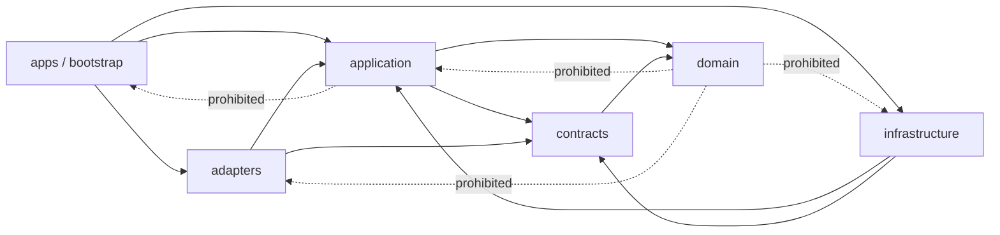

# Module Boundaries


## 1. Decision and status


The implementation remains one Python modular monolith in `RMF112018/my-pa`, consistent with ADR-001. It has separately runnable gateway and worker processes and an operator CLI, but one domain, one application model, and one repository. This document constrains later implementation; it does not create executable modules or authorize implementation.


Authenticated basis: `main@3e6f7218b424f8f7dc6c5bac78956dfffe0cb8ae`. Exact tree SHA and local worktree state are unavailable. The package must be revalidated before repository integration.


## 2. Rationale


The MCV needs synchronous read/query access, asynchronous extraction/index work, and local administrative commands. Separate process entry points provide lifecycle and resource isolation without introducing distributed-system contracts. A single codebase keeps policy, provenance, IDs, errors, and domain invariants consistent.


Premature microservices, plugin systems, service layers, generalized agent frameworks, Redis/Celery, graph/vector stores, and provider registries are rejected until a current measured need exists.


## 3. Proposed package shape


The exact path structure may be refined by a separately authorized implementation plan, but responsibilities must remain equivalent and minimal:


```text
src/my_pa/
  domain/                 # entities, values, invariants, typed states/errors
  contracts/              # stable public/domain schemas and ports
  application/            # use cases, orchestration, policy/disclosure decisions
  infrastructure/
    persistence/          # PostgreSQL repositories, UoW, migrations integration
    jobs/                 # PostgreSQL-backed job/lease/outbox implementations
    audit/                # durable redacted audit implementation
    policy/               # configured policy implementation
  adapters/
    http/                 # HTTP transport mapping only
    mcp/                  # MCP transport mapping only
    cli/                  # CLI presentation/input mapping only
    sources/              # fixture and later provider adapters
    extraction/           # bounded text/Markdown and decision-gated PDF adapters
  bootstrap/              # configuration, dependency composition, process setup
  apps/
    gateway.py            # my-pa-gateway composition root
    worker.py             # my-pa-worker composition root
    cli.py                # my-pa composition root
```


A directory is not implementation authority. Only modules needed by the accepted vertical slice should be created.


## 4. Dependency rule





Normative rule: `apps/bootstrap → application/infrastructure → domain/contracts`. Adapters depend inward on application/contracts. Infrastructure implements ports declared inward. Domain depends on the Python standard library and stable domain primitives only.


## 5. Boundary responsibilities


### 5.1 `domain`


Owns opaque typed IDs and values; source, object, version, enrollment, operation, coverage, knowledge, and audit concepts; authority/trust/classification/purpose states; lifecycle transitions; typed errors; and the source-read-only/model-nonauthority invariants.


It must not import FastAPI, MCP SDK, SQLAlchemy, Alembic, PostgreSQL drivers, filesystem/provider SDKs, parser libraries, logging frameworks, environment loaders, or composition code.


### 5.2 `contracts`


Owns transport-neutral public request/response/disclosure/error schemas and application ports for source reading, persistence, jobs, policy, audit, extraction, clocks, and IDs. DTOs do not expose ORM or provider objects. Contracts are introduced only for a current use case; speculative extension points are prohibited.


### 5.3 `application`


Owns the eight public capability use cases; request normalization; semantic validation; principal/purpose/scope authorization; enrollment normalization/idempotency; source and knowledge orchestration; disclosure construction; operation/cancellation/recovery coordination; transaction boundaries; and mapping internal failures to public errors.


It does not parse HTTP/MCP, execute SQL, open files, call provider SDKs, or embed process lifecycle.


### 5.4 `infrastructure.persistence`


Owns later SQLAlchemy mappings/repositories, unit-of-work, Alembic integration, PostgreSQL FTS/`pg_trgm`, safe parameterization, and schema constraints. ORM models are private. Implementation starts against an isolated disposable database and may not infer or connect to an existing physical database.


### 5.5 `infrastructure.jobs`


Owns later PostgreSQL-backed job records, leases, attempts, retry state, cancellation, and outbox behavior. Claims and transitions are atomic and idempotent. Poison work quarantines rather than looping. This boundary does not justify Redis/Celery.


### 5.6 `infrastructure.policy` and `infrastructure.audit`


Policy evaluates principal, purpose, capability, scope, classification, fields, and destination. Audit persists redacted events. Policy is not hidden in transport or adapter conditionals. Security-relevant or operator-only actions fail closed if required audit persistence fails. Audit excludes source content, queries, credentials, paths, hosts, and personal identifiers by default.


### 5.7 Transport adapters


`adapters.http`, `adapters.mcp`, and `adapters.cli` own protocol parsing/serialization, authentication-context extraction, safe status mapping, transport limits, and cancellation signals. They contain no business or authorization logic beyond invoking application contracts. HTTP and MCP conformance tests prove semantic equivalence. CLI is not a privileged bypass.


### 5.8 Source adapters


`adapters.sources` translates provider-specific list, metadata, bounded fetch, version/fingerprint, and status behavior. It has no source-write API. Fixture adapter is first; NAS adapter is later and receives configured roots. Runtime does not execute SSH or depend on an SSH alias. Provider errors are normalized/redacted, and physical paths/provider IDs remain internal.


### 5.9 Extraction adapters


`adapters.extraction` owns bounded parser calls and normalized outcomes. It receives bytes and media evidence and returns text, safe metadata, limitations, or quarantine reason. Parsers receive no credentials, source-write handles, unrestricted filesystem, or tool authority. Text/Markdown are mandatory; PDF is decision-gated; archive recursion is excluded.


### 5.10 Bootstrap and apps


Bootstrap loads validated configuration, constructs implementations, and attaches process lifecycle. Only composition roots choose concrete implementations:


- `apps.gateway`: HTTP/MCP surfaces;
- `apps.worker`: bounded polling/lease execution;
- `apps.cli`: operator commands.


Configuration uses `MY_PA_` and inert examples. Secrets enter at runtime only. Active former-employer naming is prohibited.


## 6. Public versus internal contracts


### Public


- Capability names and `v1` request/response/error/disclosure shapes.
- Opaque IDs and UTC timestamps.
- Pagination, truncation, idempotency, partial-result, quarantine, and availability semantics.


### Internal conformance contracts


- Read-only source-provider port.
- Extractor result contract.
- Policy decision and audit-event contracts.
- Repository/unit-of-work and job-operation ports.


### Private implementation details


- ORM models/table names, SQL, migrations;
- filesystem paths, provider IDs/SDK objects;
- parser/library classes;
- process wiring, hosts, database URLs, credentials, and SSH details.


Public schemas may not import or serialize private implementation objects.


## 7. Provider conformance


A minimal source-provider concept supports only immediate-child list, normalized metadata, bounded bytes fetch tied to an observed version, availability/status, and stable internal resolution from opaque IDs.


Conformance requires denial of traversal/containment escape; denial of unknown/ambiguous identity; no write/rename/move/delete/permission/upload methods; deterministic fixture pagination/order; version conflict detection; redacted error normalization; bounded I/O; and cancellation. A provider registry/plugin framework is unnecessary for the first fixture.


## 8. Capability ownership


| Capability | Application owner | Required ports | Adapter surface |
|---|---|---|---|
| `capabilities.get` | capability query | policy/config view | HTTP/MCP/CLI read |
| `sources.list` | source listing | policy, source provider, audit | HTTP/MCP/CLI |
| `sources.metadata` | source metadata | policy, source provider, audit | HTTP/MCP/CLI |
| `sources.fetch` | bounded source read | policy, source provider, audit | HTTP/MCP/CLI |
| `sources.status` | status query | policy, repositories/jobs | HTTP/MCP/CLI |
| `sources.enroll` | enrollment command | policy, UoW, jobs/outbox, audit | operator CLI/authenticated operator transport |
| `knowledge.search` | lexical search | policy, knowledge repository, audit | HTTP/MCP/CLI |
| `knowledge.read` | knowledge read | policy, knowledge/provenance repository, audit | HTTP/MCP/CLI |


## 9. Future capability ownership


| Area | MCV ownership | Later constraint |
|---|---|---|
| Read-only sources | Domain/application + source adapter | Cannot gain write methods through provider expansion |
| Managed documents | Excluded | Separate domain/port/root/transactions/versioning/recovery |
| Knowledge lifecycle | Source-bound extracted records only | Assertions/inferences/proposals require explicit promotion states |
| Personal connectors | Excluded | Observations remain provider-bound and sensitive |
| Relationships | Excluded | No scoring, sensitive-trait inference, or consequential action |
| Projection | Excluded | Rebuildable; no reverse authority |
| Model gateway | Excluded from required path | Field-level disclosure and proposal-only output |


## 10. Transaction and failure boundaries


### Enrollment


Normalize → authorize → check idempotency → persist enrollment, operation/job, audit, and outbox in one application transaction. A partial commit must not create work without authority/evidence.


### Extraction


Source bytes are read outside the DB transaction. Worker binds observed version, validates/extracts, then commits version-specific result, coverage, provenance, and audit idempotently. If version changed or lease is lost, result is rejected/quarantined.


### Search/read


A bounded read-only DB transaction returns records/provenance; disclosure is built from that consistent result. Long source fetches are not held inside DB transactions.


### Failures


Infrastructure failures map to typed application state. Retried work is bounded/idempotent. Cancellation reports truthful partial state. Audit failure for protected commands is fail-closed. Policy/identity ambiguity never broadens authority.


## 11. Testing seams and architecture rules


### Unit/contract


- Pure domain lifecycle/invariant tests.
- Application use cases with fakes for source, policy, repositories, jobs, audit, clock, and IDs.
- Public schema examples, strict unknown-field behavior, errors, and disclosure truthfulness.


### Integration


- Disposable PostgreSQL repositories, migrations, FTS, jobs/leases/outbox.
- Fixture-provider containment/version behavior.
- Extractor limits/quarantine.
- HTTP/MCP normalized conformance.


### Architecture tests


- `domain` imports no application/infrastructure/adapters/bootstrap/framework/ORM/provider/parser modules.
- `application` imports no transport, ORM, SQL, provider SDK, or concrete parser.
- Transports do not import infrastructure or provider implementations directly.
- Source-provider interfaces expose no mutation operations.
- Public schemas contain no path, host, DB URL, provider-native ID, ORM, or credential field.
- Only composition roots instantiate concrete implementations.


FAST remains deterministic and network/database-free. PR adds affected isolated DB/provider/security integration within the repository test budget.


## 12. Split triggers and rejected complexity


An independently deployed service requires measured resource isolation, materially different credential/security domain, independent scaling causing harm, separate ownership/release cadence, or justified failure/availability isolation. A provider/plugin framework requires at least two current implementations with stable demonstrated common behavior.


Microservices, generic plugins, generalized agent frameworks, Redis/Celery, graph/vector-first storage, and additional governance services are rejected for the MCV.


## 13. Phase mapping


| Phase | Boundary responsibility | Acceptance implication |
|---|---|---|
| 00 | Freeze public/domain/authority/security boundaries | No code; coherent contracts/routing |
| 01 | Minimal package, schemas, ports, policy kernel | Dependency and public no-leak tests |
| 02 | Disposable PostgreSQL, migrations, jobs/outbox | ORM private; idempotent transactions/migrations |
| 03 | Fixture then separately approved source provider | Read-only conformance and containment denial |
| 04 | Enrollment, extraction, quarantine, coverage, FTS | Version-bound partial/unsupported/quarantine behavior |
| 05 | HTTP/MCP read-only gateway | Transport equivalence and policy enforcement |


## 14. Acceptance criteria


- `MB-AC-001`: Every responsibility has one clear owner and dependency direction.
- `MB-AC-002`: Domain/application are isolated from transport, ORM, provider, parser, host, and database details.
- `MB-AC-003`: Source providers cannot mutate; managed writes remain a separate excluded boundary.
- `MB-AC-004`: Jobs, policy, audit, provenance, and transactions are constrained without unsupported infrastructure.
- `MB-AC-005`: Testing seams and architecture rules are enforceable in Phases 01–05.
- `MB-AC-006`: Future areas are identified without becoming current implementations/frameworks.


## 15. Invalidation and next gate


Material changes to ADR-001, composition roots, dependency direction, source/managed-write separation, public capability set, or structured authority invalidate this candidate. Next gate is a separately authorized document-only repository integration and independent exact-head review; implementation remains unauthorized.


## 16. Related documents


- [`../specs/mcv-read-only-vertical-slice.md`](../specs/mcv-read-only-vertical-slice.md)
- [`system-context.md`](system-context.md)
- [`data-authority.md`](data-authority.md)
- [`../security/threat-model.md`](../security/threat-model.md)
- [`../../PHASE-00-OPEN-DECISION-LEDGER.md`](../../PHASE-00-OPEN-DECISION-LEDGER.md)
