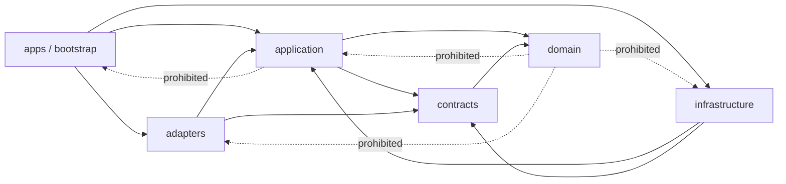

# Module Boundaries


## 1. Decision and status


The implementation is one Python modular monolith in `RMF112018/my-pa`, consistent with ADR-001. It has separately runnable gateway and worker processes and operator CLI programs, but one domain, one application model, and one repository. This document records the current implemented boundaries.


Authenticated branch basis: `main@9b35476b70fe4fbc03bb8f9835d93c1b71089bbe`. The remediation PR records its exact reviewed head and validation evidence; later commits invalidate that exact-head evidence.


## 2. Rationale


The MCV needs synchronous read/query access, asynchronous extraction/index work, and local administrative commands. Separate process entry points provide lifecycle and resource isolation without introducing distributed-system contracts. A single codebase keeps policy, provenance, IDs, errors, and domain invariants consistent.


Premature microservices, plugin systems, service layers, generalized agent frameworks, Redis/Celery, graph/vector stores, and provider registries are rejected until a current measured need exists.


## 3. Package shape


This section opened as a proposal and permitted refinement by a separately
authorized implementation plan, provided responsibilities stayed equivalent and
minimal. WP-4B2a performed that refinement under decision `D-23`, and the shape
below is now the repository's, not a candidate.


**Which way it was reconciled, and why that way.** The tree and the earlier
drawing disagreed: the drawing put every adapter under `adapters/` and the
composition roots under `src/my_pa/apps/`, while the implementation had put the
source, extraction, migration, and persistence adapters under `infrastructure/`
and the composition roots at repository-root `apps/`. **The document was
reconciled toward the tree**, not the tree toward the document, and the rule
that reconciles it is the driving/driven split rather than a list of exceptions:


- an adapter that **drives** the application — a protocol a request arrives on —
  lives in `src/my_pa/adapters/{http,mcp,cli}/`;
- an adapter the application **drives** — a store, a provider, a parser, the
  migration plane — lives in `src/my_pa/infrastructure/`;
- composition roots are executable scripts at repository-root `apps/`, a sibling
  of `src/`, because they are programs rather than importable library modules.


Reconciling this way moved no module, and three sections need their current
addresses said plainly rather than left to be worked out.

- **5.8, `adapters.sources`,** is `infrastructure/providers/`. A rename would
  have been churn in exchange for agreeing with a drawing.
- **5.9, `adapters.extraction`,** is in two halves and only one of them exists.
  The text and Markdown half is `domain/extraction/text.py`: a bounded decode
  over bytes, using nothing but the standard library, which is why it can live
  in `domain` at all. The **parser** half — 5.9's "bounded parser calls", the
  decision-gated PDF path — has no home yet and could not have one there:
  section 5.1 forbids `domain` importing a parser library, so when a parser
  arrives it belongs under `infrastructure/`, where `infrastructure/extraction/`
  is a reserved directory holding a README and nothing else. `P00-OD-003` is
  what has not been decided, and until it is there is no parser to place.
- **5.6, `infrastructure.policy` and `infrastructure.audit`,** names two
  directories that do not exist, and the reason differs for each. Audit is a
  directory question only: it is `infrastructure/persistence/audit.py`, beside
  the unit of work whose transaction it deliberately does not share. **Policy is
  a layer question**, which matters more: there is no `infrastructure.policy`
  and there is not going to be one, because policy is decided in
  `application/authorization.py` over `domain/policy/decision.py`. That is not a
  relocation of 5.6's responsibility but a stronger reading of its own last
  sentence — "policy is not hidden in transport or adapter conditionals" — since
  a policy that is not an adapter at all cannot be hidden in one. 5.6's
  requirements stand where they are: one evaluation path, redacted audit, and
  fail-closed persistence.

Section 5.7's transport adapters keep their names and their meaning exactly. No
responsibility in sections 5.1 through 5.11 is changed by this amendment — it
describes where each lives, and nothing else.


```text
src/my_pa/
  domain/                 # entities, values, invariants, typed states/errors
  contracts/              # stable public/domain schemas and ports
  application/            # use cases, orchestration, policy/disclosure decisions
  adapters/               # driving adapters: protocol mapping only
    normalization.py      # the one request-normalisation path all three transports use
    http/                 # HTTP transport mapping only
    mcp/                  # MCP transport mapping only, stdio
    cli/                  # CLI presentation/input mapping only
  infrastructure/         # driven adapters: implementations of declared ports
    database/             # engine and connection contract
    persistence/          # PostgreSQL repositories, UoW, audit sink, search
    jobs/                 # PostgreSQL-backed job/lease/outbox implementations
    providers/            # fixture and later source-provider adapters
    migration/            # legacy extract, load, and the migration control plane
    ...                   # further reserved directories hold a README only
  bootstrap/              # configuration, dependency composition, process setup
apps/                     # repository root, a sibling of `src/`
  gateway.py              # my-pa-gateway composition root: HTTP and MCP surfaces
  worker.py               # my-pa-worker composition root
  cli/                    # invoke.py, and the operator commands migration.py and sources.py
```


The dependency rule in section 4 is unchanged and now has a name for its middle
row: `apps`/`bootstrap` → `adapters` → `application` → `contracts`/`domain`,
with `infrastructure` a sibling of `application` implementing ports declared
inward. `tests/architecture/test_dependency_direction.py` enforces the ordering,
and `tests/architecture/test_transport_adds_no_behaviour.py` enforces that a
driving adapter contains no decision, no disclosure, no SQL, and no provider
access.


A directory is not implementation authority. Only modules needed by the accepted
vertical slice should be created. `adapters/mcp` and `adapters/cli` were named
above by `D-23` before either existed; WP-4B2b built both, and the amendment
here is that sentence catching up rather than a change of shape. `apps/cli/`
now holds operator programs including `migration.py`, `invoke.py`, `sources.py`,
and the later capture, managed-document, GoodNotes, and identity commands;
`apps/gateway.py` serves both surfaces section 5.10 gives it,
HTTP under `run` and MCP under `mcp`. Every other reserved directory still holds
a README and nothing else.

The operator commands and transport entry point share this directory, and the split is
the reason they sit together rather than a reason to separate them. `invoke.py`
invokes one of the forty-seven capabilities and therefore composes
`bootstrap.gateway.build_gateway_runtime`, exactly as the served transports do,
so it cannot differ from them in a limit, a clock, or a principal.
`migration.py` and `sources.py` invoke none, compose their own engine, and reach
`infrastructure` directly. `D-42` records why source registration is one of the
second kind: source registration is named by no canonical capability, and a
capability for it is what an operator command must not become. That ruling
stands; what does **not** stand is the reason it used to be given in, "the
capability set is closed at eight by the canonical contract". `D-68` narrows
`D-42`'s general premise for the capture family alone — `capture.create` is
named by the canonical package in six places, and the other three are a
repository decision under `ADR-003:107`, which reserves capability names to "an
implementing work package and its pull request". The set is thirty, and it is
closed against a ninth *source-registration* capability rather than against a
ninth member.


## 4. Dependency rule





Normative rule: `apps/bootstrap → application/infrastructure → domain/contracts`. Adapters depend inward on application/contracts. Infrastructure implements ports declared inward. Domain depends on the Python standard library and stable domain primitives only.


## 5. Boundary responsibilities


### 5.1 `domain`


Owns opaque typed IDs and values; source, object, version, enrollment, operation, coverage, knowledge, and audit concepts; authority/trust/classification/purpose states; lifecycle transitions; typed errors; and the source-read-only/model-nonauthority invariants.


It must not import FastAPI, MCP SDK, SQLAlchemy, Alembic, PostgreSQL drivers, filesystem/provider SDKs, parser libraries, logging frameworks, environment loaders, or composition code.


### 5.2 `contracts`


Owns transport-neutral public request/response/disclosure/error schemas and application ports for source reading, persistence, jobs, policy, audit, extraction, clocks, and IDs. DTOs do not expose ORM or provider objects. Contracts are introduced only for a current use case; speculative extension points are prohibited.


### 5.3 `application`


Owns the thirty public capability use cases; request normalization; semantic validation; principal/purpose/scope authorization; enrollment normalization/idempotency; capture admission, idempotent replay, and the durable-first save; source, knowledge, capture, and managed-document orchestration; disclosure construction; operation/cancellation/recovery coordination; transaction boundaries; and mapping internal failures to public errors.


It does not parse HTTP/MCP, execute SQL, open files, call provider SDKs, or embed process lifecycle.


### 5.4 `infrastructure.persistence`


Owns later SQLAlchemy mappings/repositories, unit-of-work, Alembic integration, PostgreSQL FTS/`pg_trgm`, safe parameterization, and schema constraints. ORM models are private. Implementation starts against an isolated disposable database and may not infer or connect to an existing physical database.


### 5.5 `infrastructure.jobs`


Owns later PostgreSQL-backed job records, leases, attempts, retry state, cancellation, and outbox behavior. Claims and transitions are atomic and idempotent. Poison work quarantines rather than looping. This boundary does not justify Redis/Celery.


### 5.6 `infrastructure.policy` and `infrastructure.audit`


Policy evaluates principal, purpose, capability, scope, classification, fields, and destination. Audit persists redacted events. Policy is not hidden in transport or adapter conditionals. Security-relevant or operator-only actions fail closed if required audit persistence fails. Audit excludes source content, queries, credentials, paths, hosts, and personal identifiers by default.


### 5.7 Transport adapters


`adapters.http`, `adapters.mcp`, and `adapters.cli` own protocol parsing/serialization, authentication-context extraction, safe status mapping, transport limits, and cancellation signals. They contain no business or authorization logic beyond invoking application contracts. HTTP and MCP conformance tests prove semantic equivalence. CLI is not a privileged bypass.


### 5.8 Source adapters


`adapters.sources` translates provider-specific list, metadata, bounded fetch, version/fingerprint, and status behavior. It has no source-write API. Fixture adapter is first; NAS adapter is later and receives configured roots. Runtime does not execute SSH or depend on an SSH alias. Provider errors are normalized/redacted, and physical paths/provider IDs remain internal.


### 5.9 Extraction adapters


`adapters.extraction` owns bounded parser calls and normalized outcomes. It receives bytes and media evidence and returns text, safe metadata, limitations, or quarantine reason. Parsers receive no credentials, source-write handles, unrestricted filesystem, or tool authority. Text/Markdown are mandatory; PDF is decision-gated; archive recursion is excluded.


### 5.11 `domain.capture` and `infrastructure.persistence.capture`


Owns the user-authored record class ADR-003 defines: capture and version
identity, the append-only version chain, lifecycle and authority states, evidence
spans on `unicode_code_point_v1`, and the typed errors for conflict, oversized
text, and idempotency reuse.


It does not import the source-provider port and exposes no update or delete of
stored text. An architecture test asserts both, because the guarantee is worth
more as a structural property than as a convention.


### 5.10 Bootstrap and apps


Bootstrap loads validated configuration, constructs implementations, and attaches process lifecycle. Only composition roots choose concrete implementations:


- `apps.gateway`: HTTP/MCP surfaces;
- `apps.worker`: bounded polling/lease execution;
- `apps.cli`: operator commands.


Configuration uses `MY_PA_` and inert examples. Secrets enter at runtime only. Active former-employer naming is prohibited.


## 6. Public versus internal contracts


### Public


- Capability names and `v1` request/response/error/disclosure shapes.
- Opaque IDs and UTC timestamps.
- Pagination, truncation, idempotency, partial-result, quarantine, and availability semantics.


### Internal conformance contracts


- Read-only source-provider port.
- Extractor result contract.
- Policy decision and audit-event contracts.
- Repository/unit-of-work and job-operation ports.


### Private implementation details


- ORM models/table names, SQL, migrations;
- filesystem paths, provider IDs/SDK objects;
- parser/library classes;
- process wiring, hosts, database URLs, credentials, and SSH details.


Public schemas may not import or serialize private implementation objects.


## 7. Provider conformance


A minimal source-provider concept supports only immediate-child list, normalized metadata, bounded bytes fetch tied to an observed version, availability/status, and stable internal resolution from opaque IDs.


Conformance requires denial of traversal/containment escape; denial of unknown/ambiguous identity; no write/rename/move/delete/permission/upload methods; deterministic fixture pagination/order; version conflict detection; redacted error normalization; bounded I/O; and cancellation. A provider registry/plugin framework is unnecessary for the first fixture.


## 8. Capability ownership


| Capability | Application owner | Required ports | Adapter surface |
|---|---|---|---|
| `capabilities.get` | capability query | policy/config view | HTTP/MCP/CLI read |
| `sources.list` | source listing | policy, source provider, audit | HTTP/MCP/CLI |
| `sources.metadata` | source metadata | policy, source provider, audit | HTTP/MCP/CLI |
| `sources.fetch` | bounded source read | policy, source provider, audit | HTTP/MCP/CLI |
| `sources.status` | status query | policy, repositories/jobs | HTTP/MCP/CLI |
| `sources.enroll` | enrollment command | policy, UoW, jobs/outbox, audit | operator CLI/authenticated operator transport |
| `knowledge.search` | lexical search | policy, knowledge repository, audit | HTTP/MCP/CLI |
| `knowledge.read` | knowledge read | policy, knowledge/provenance repository, audit | HTTP/MCP/CLI |
| `capture.create` | capture admission | policy, UoW, capture repository, capture jobs/outbox, audit | HTTP/MCP/CLI |
| `capture.revise` | capture supersession | policy, UoW, capture repository, capture jobs/outbox, audit | HTTP/MCP/CLI |
| `capture.read` | capture version read | policy, capture repository, audit | HTTP/MCP/CLI |
| `capture.list` | capture listing | policy, capture repository, audit | HTTP/MCP/CLI |


## 9. Future capability ownership


| Area | MCV ownership | Later constraint |
|---|---|---|
| Read-only sources | Domain/application + source adapter | Cannot gain write methods through provider expansion |
| Managed documents | Excluded | Separate domain/port/root/transactions/versioning/recovery |
| Knowledge lifecycle | Source-bound extracted records and user-authored records with span-bound proposals | Promotion to canonical requires a governed review disposition |
| Personal connectors | Fixture only | Live observations remain provider-bound, sensitive, and separately authorized |
| Relationships | Read-only identity and profiles | No scoring, sensitive-trait inference, synthesis, or consequential action |
| Projection | Excluded | Rebuildable; no reverse authority |
| Model gateway | Excluded from required path | Field-level disclosure and proposal-only output |


## 10. Transaction and failure boundaries


### Enrollment


Normalize → authorize → check idempotency → persist enrollment, operation/job, audit, and outbox in one application transaction. A partial commit must not create work without authority/evidence.


### Extraction


Source bytes are read outside the DB transaction. Worker binds observed version, validates/extracts, then commits version-specific result, coverage, provenance, and audit idempotently. If version changed or lease is lost, result is rejected/quarantined.


### Capture


Normalize → authorize → admit under a unique idempotency key → persist the capture, its version, its submission, its receipt, and its queued processing job in one application transaction. A key already bound to byte-identical content returns the stored receipt and writes nothing; a key bound to different content is `conflict` and writes nothing.

The redacted audit event is **not** in that transaction and this is the same `D-34` carve-out the enrollment paragraph above already lives under: the sink takes its own connection and commits before the handler runs, and the stored version keeps the audit *reference*. A failed audit fails the request closed and no capture exists afterwards; a failed work transaction leaves an audit event describing an authorization whose work never landed, which is the correct direction of the trade. `tests/capture/test_transaction_fails_closed.py` holds both ends.


### Search/read


A bounded read-only DB transaction returns records/provenance; disclosure is built from that consistent result. Long source fetches are not held inside DB transactions.


### Failures


Infrastructure failures map to typed application state. Retried work is bounded/idempotent. Cancellation reports truthful partial state. Audit failure for protected commands is fail-closed. Policy/identity ambiguity never broadens authority.


## 11. Testing seams and architecture rules


### Unit/contract


- Pure domain lifecycle/invariant tests.
- Application use cases with fakes for source, policy, repositories, jobs, audit, clock, and IDs.
- Public schema examples, strict unknown-field behavior, errors, and disclosure truthfulness.


### Integration


- Disposable PostgreSQL repositories, migrations, FTS, jobs/leases/outbox.
- Fixture-provider containment/version behavior.
- Extractor limits/quarantine.
- HTTP/MCP normalized conformance.


### Architecture tests


- `domain` imports no application/infrastructure/adapters/bootstrap/framework/ORM/provider/parser modules.
- `application` imports no transport, ORM, SQL, provider SDK, or concrete parser.
- Transports do not import infrastructure or provider implementations directly.
- Source-provider interfaces expose no mutation operations.
- Public schemas contain no path, host, DB URL, provider-native ID, ORM, or credential field.
- Only composition roots instantiate concrete implementations.


FAST remains deterministic and network/database-free. PR adds affected isolated DB/provider/security integration within the repository test budget.


## 12. Split triggers and rejected complexity


An independently deployed service requires measured resource isolation, materially different credential/security domain, independent scaling causing harm, separate ownership/release cadence, or justified failure/availability isolation. A provider/plugin framework requires at least two current implementations with stable demonstrated common behavior.


Microservices, generic plugins, generalized agent frameworks, Redis/Celery, graph/vector-first storage, and additional governance services are rejected for the MCV.


## 13. Phase mapping


| Phase | Boundary responsibility | Acceptance implication |
|---|---|---|
| 00 | Freeze public/domain/authority/security boundaries | No code; coherent contracts/routing |
| 01 | Minimal package, schemas, ports, policy kernel | Dependency and public no-leak tests |
| 02 | Disposable PostgreSQL, migrations, jobs/outbox | ORM private; idempotent transactions/migrations |
| 03 | Fixture then separately approved source provider | Read-only conformance and containment denial |
| 04 | Enrollment, extraction, quarantine, coverage, FTS | Version-bound partial/unsupported/quarantine behavior |
| 05 | HTTP/MCP read-only gateway | Transport equivalence and policy enforcement |


## 14. Acceptance criteria


- `MB-AC-001`: Every responsibility has one clear owner and dependency direction.
- `MB-AC-002`: Domain/application are isolated from transport, ORM, provider, parser, host, and database details.
- `MB-AC-003`: Source providers cannot mutate; objective-authorized managed writes remain a separate product-owned boundary.
- `MB-AC-004`: Jobs, policy, audit, provenance, and transactions are constrained without unsupported infrastructure.
- `MB-AC-005`: Testing seams and architecture rules are enforceable in Phases 01–05.
- `MB-AC-006`: Future areas are identified without becoming current implementations/frameworks.


## 15. Invalidation and next gate


Material changes to ADR-001, composition roots, dependency direction, source/managed-write separation, public capability set, or structured authority invalidate this record. Managed-document writes are implemented only under this remediation objective's explicit reprioritization and remain separate from source providers; this statement records implementation and does not amend `AGENTS.md`. Candidate acceptance requires applicable validation and independent review against the exact current head. Live personal-data access, source mutation, deployment, and other operator-reserved actions remain unauthorized by this document.


## 16. Related documents


- [`../specs/mcv-read-only-vertical-slice.md`](../specs/mcv-read-only-vertical-slice.md)
- [`system-context.md`](system-context.md)
- [`data-authority.md`](data-authority.md)
- [`../security/threat-model.md`](../security/threat-model.md)
- [`../../PHASE-00-OPEN-DECISION-LEDGER.md`](../../PHASE-00-OPEN-DECISION-LEDGER.md)
