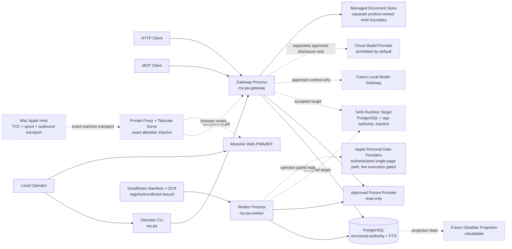
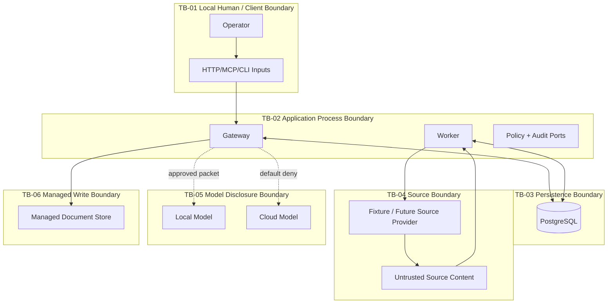
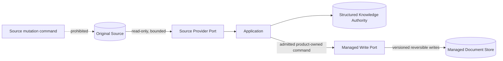

# System Context

## 1. Purpose and status

`my-pa` is the local-first Personal Knowledge Layer between a local operator,
authorized source systems, structured knowledge storage, and policy-bound
retrieval interfaces. The MCV remains one bounded vertical slice, with frontend
and managed-document implementation admitted only for the current remediation
objective. This objective-specific reprioritization does not amend repository
policy; the stale policy inconsistency remains recorded for later, separately
authorized operator correction.

This document refines the accepted foundation in ADR-001, ADR-002, and ADR-008.
It records the accepted NAS target without claiming that the target is deployed.
It does not itself authorize live NAS/database access, deployment, production
activation, or risk acceptance. Its NAS-target lineage starts at authenticated
base `main@c10ecf397e1556ac5da64ff49a608aa8e963cdb3`; the candidate's exact
head/tree and clean-worktree evidence are maintained in the pull request and
final-state record, where they can be updated without a self-referential commit
hash.

## 2. Actors and external systems

| ID | Context element | Role | MCV state | Authority boundary |
|---|---|---|---|---|
| `CTX-PKL-001` | Local operator | Selects approved fixture scope, invokes CLI/gateway, reviews limitations | Active | Human operator-only decisions remain explicit |
| `CTX-PKL-002` | HTTP/MCP client | Calls public read-only capabilities | Active through synthetic client tests | Never supplies its own authority merely by claiming a principal/purpose |
| `CTX-PKL-003` | Operator CLI | Composition surface for administrative actions | Active | Same application policy as HTTP/MCP; no bypass |
| `CTX-PKL-004` | Gateway process | Request normalization, authorization, query/read coordination | Active | No direct provider/persistence bypass |
| `CTX-PKL-005` | Worker process | Bounded extraction/index/recovery jobs | Active | Executes persisted authorized work only |
| `CTX-PKL-006` | PostgreSQL | Canonical structured authority and FTS | Implemented and validated on disposable synthetic databases | No unknown/existing physical target is authorized |
| `CTX-PKL-007` | Fixture source provider | Approved bounded read-only source | Active | Original bytes authoritative; adapter cannot mutate |
| `CTX-PKL-008` | NAS/source providers | Future real read-only sources | Later phase | Must receive configured allowed roots; no discovery outside them |
| `CTX-PKL-009` | Local model gateway | Deferred context consumer/generator | Disabled; no production provider or router invocation exists | Future output would be proposed/inferred, never source authority |
| `CTX-PKL-010` | Cloud model provider | External processing boundary | Excluded by default | Raw/private data disclosure prohibited absent separate approval |
| `CTX-PKL-011` | Managed-document store | Separate product-owned write-authority capability | Implemented for this remediation objective | Designated storage only; no source-system write or deployment authority |
| `CTX-PKL-012` | Obsidian projection | Rebuildable human-facing view | Later phase | Derived projection, never canonical authority |
| `CTX-PKL-013` | Apple Mail/Calendar/Contacts/Tasks providers | Personal-data observations | Bounded mechanisms plus inert dry-run and authenticated application-to-host single-page handoff; no permission-request path and no live read executed | TCC, live data, activation, signing, and deployment require separate authority |
| `CTX-PKL-015` | Local operator as author | Creates user-authored records through the capture contract | Active under ADR-003 | Authors evidence the product owns; authoring is neither source mutation nor a managed write |
| `CTX-PKL-014` | Public research providers | External evidence collection | Excluded | No public research or automated profiling in MCV |
| `CTX-PKL-016` | MossAIc web frontend | Next.js App Router PWA/BFF | Implemented for this remediation objective | Uses public capability contracts; no provider or database bypass |
| `CTX-PKL-017` | GoodNotes manifest source | Read-only page representations into OCR/Review | Implemented with exact registry/enrollment binding | No traversal, cloud OCR/model, watcher, or live-root admission |
| `CTX-PKL-018` | NAS runtime host | Accepted canonical deployment target; not deployed | Staged through NAS-01–NAS-10 | Owns PostgreSQL and application filesystem authority only after gated activation |
| `CTX-PKL-019` | Private reverse proxy and Tailscale Serve | Accepted pilot ingress; inactive | Exact allowlist with one published container | Tailnet-only; generic capabilities and unmatched machine routes fail closed |
| `CTX-PKL-020` | Mac Apple transport host | Accepted target split; not deployed | Apple TCC read, protected spool, outbound polling only | No database credential, general NAS filesystem credential, or grant-minting authority |

## 3. Current versus target context

### 3.1 Authenticated current repository state

The repository is an executable local candidate, not a documentation scaffold.
The `my_pa` application exposes forty-seven capabilities through HTTP, MCP, and
CLI composition, with PostgreSQL Principal partitioning and two worker planes.
Alembic owns fifty-four revisions at head `c3e9a7f1b204`, including the merge of
the retained native-baseline and managed-document histories. `context.prepare`
returns `retrieval_mode=lexical_structured` (`lexical_structured.v1`); the
semantic-retrieval gate remains `SEMANTIC_GATE_FAIL` and production semantic
retrieval is not authorized. The web BFF calls
those capabilities, supports a server-side Entra authorization-code + PKCE
session path without exposing its bearer, and publishes content-free worker
backlog/liveness states through `capabilities.get` and System. Apple personal
sources remain first-party and Graph remains off by default.

Current-state correction: the native host can construct its production
composition, place content-free dry-run receipts into the protected spool, and
has a separate expiring-grant path for one checkpointed page per selected Apple
bucket into immutable admission envelopes. No TCC grant was requested and no
live source read was executed. GoodNotes reconciliation is bound to
exact registry versions and Principal enrollment before OCR, then enters
ordinary canonical Review/search. Managed documents and the MossAIc frontend
are implemented under the current objective-specific reprioritization; neither
fact amends the still-stale policy.

Historical note: the earlier figures (eleven, then twenty-one revisions; eight,
then twelve capabilities) were accurate at their dated work-package heads. They
are preserved in campaign records and are not current-state claims.

### 3.2 MCV target context

The implemented target uses one internal application/domain model and four
composition surfaces:

- `my-pa-gateway`: HTTP and MCP adapters over the same application use cases;
- `my-pa-worker`: durable bounded extraction/index/recovery execution;
- `my-pa`: operator CLI for administrative use cases.
- `web`: Next.js PWA/BFF over the same public capability contracts.

All surfaces share the same public/domain contracts and policy decisions.
PostgreSQL holds structured metadata, provenance, audit, operation/jobs,
coverage, extracted text, managed-document metadata, Review state, and lexical
indexes. Repository validation uses synthetic fixtures and disposable databases;
no live personal source is activated. No model is required for correctness, and
GoodNotes invokes none.

### 3.3 Accepted NAS deployment target

ADR-008 accepts the NAS as the canonical deployment host for PostgreSQL,
gateway, worker planes, web/BFF, and the sole published reverse proxy. The Mac
retains only Apple TCC access, its protected spool, and an outbound transport
agent. Browser routes go to web; only exact approved machine paths can reach
the gateway. PostgreSQL and generic `/v1/*` capabilities are not published.

This is a target-state contract, not a deployment claim. NAS-02 through NAS-10
must measure the live platform, build and verify exact images, establish
storage and credentials, prove smoke/backup/restore/security behavior, activate
private ingress, and complete the pilot before the target becomes operational.
Live personal-source activation, GoodNotes watcher/live-root operation,
canonical-Review-routed model assistance, and projections remain separately
gated future context.

## 4. Context diagram

Solid edges are implemented conceptual flows under the current objective.
Dashed edges remain inactive target-state or excluded until their named gates
are completed and the operator activates them.

## 5. Trust boundaries

- `TB-01`: All input is untrusted until authenticated, normalized, validated, and authorized.
- `TB-02`: Gateway and worker are separate processes but not separate services/domains. Neither may bypass application policy, provenance, or audit responsibilities.
- `TB-03`: PostgreSQL is trusted for structured state in the validated disposable
  synthetic-database path. An unknown/existing physical database and production
  activation remain unauthorized.
- `TB-04`: Source adapters and content are untrusted. Containment, type/signature, size, version, and parser controls apply. Retrieved text is never instruction authority.
- `TB-05`: Model processing is a disclosure boundary. Local is not automatically unrestricted; cloud is prohibited for raw/private MCV data by default.
- `TB-06`: Managed writes are a distinct product-owned authority and transaction
  boundary implemented for this objective; they do not grant source-system
  mutation, deployment, or unknown-target authority.

## 6. MCV data flows

### `DF-PKL-001` — Capability discovery

Client → gateway → application capability registry → policy-filtered response. The registry reports supported contracts and configured limits without internal topology or secrets.

### `DF-PKL-002` — Source list/metadata/fetch

Client → gateway/CLI → application use case → policy → source-provider port → fixture adapter → normalized result → disclosure envelope. Stable opaque IDs cross the public boundary; physical/provider identity does not.

### `DF-PKL-003` — Enrollment

Operator → CLI/gateway → authorization → normalized bounded enrollment → PostgreSQL operation/job/audit records. Enrollment permits bounded reads; it does not grant source mutation.

### `DF-PKL-004` — Extraction and indexing

Worker leases authorized work → adapter revalidates object containment/version → reads bounded bytes → validates media and resource limits → extracts or quarantines → persists source/version/provenance/coverage/text/FTS/audit atomically or through documented idempotent stages.

### `DF-PKL-005` — Search and read

Client → gateway → authorization/purpose/scope → PostgreSQL FTS or record read → disclosure assembly → transport adapter. Search coverage and freshness are explicit; a missing result is not evidence that unindexed scope contains no match.

### `DF-PKL-006` — Model context, deferred without canonical Review routing

The current production gate accepts no content, provider, or persistence port
and returns `model_route_deferred`. A future route would require authorized
retrieval → policy/classification/purpose filtering → field-level disclosure →
bounded model → durable canonical Review. Cloud transmission remains denied
until a separate operator-approved data eligibility policy and auditable receipt
exist.

## 7. Authority boundaries

| Boundary | Read authority | Mutation authority | MCV rule |
|---|---|---|---|
| Original source | Explicit approved scope only | None | Fail closed on uncertain containment or version |
| PostgreSQL structured records | Application use cases | Application-owned transactions in disposable DB after authorization | No direct transport/adapter writes |
| Enrollment/policy | Operator request plus policy | Application transaction | Operator-only; request flag is insufficient |
| Extracted text/search index | Authorized scope | Worker/application only | Derived and source-version-bound |
| Audit records | Authorized reviewers/operators | Append-only application behavior | Security-relevant audit failure is fail-closed |
| User-authored records | Owning principal within policy | Owning principal, append-only, through an application command | Immutable versions; no update or delete path; not a managed write |
| Managed documents | Owning Principal through admitted capability | Versioned application transaction into designated managed storage | Product-owned write only; never source-system mutation |
| Projection | Later read | Rebuild only | Never canonical |
| Model output | Disabled; no production invocation exists | None | Future proposals cannot mutate source/facts/policy |

## 8. Deployment-neutral interfaces

Architecture documents define ports and contracts, not deployment topology:

- public capability request/response contracts;
- source-provider read-only port;
- repository/unit-of-work ports for structured state;
- job lease/operation port;
- policy decision port;
- audit event port;
- extractor port with bounded input/output and typed result;
- disclosure assembler;
- clock/ID generators for determinism.

The implementation composes these inside two Python processes, one CLI, and the
web BFF. Ports do not imply remote services. A split requires measured scaling,
isolation, security, ownership, or deployment need and a new ADR.

## 9. Read-only source versus managed-write boundary

Source providers expose only list, metadata, bounded fetch, status, and
version/fingerprint behavior. They do not expose write methods. Managed-document
writing uses a separate admitted port, root, transaction, authorization,
versioning, retention, and recovery design. The two cannot share a generic
read/write provider that allows accidental source mutation.

## 10. Local and cloud model boundary

- No model is required for MCV correctness.
- Retrieved source content is untrusted data and may contain prompt or indirect tool injection.
- Model requests must be assembled from explicitly allowed fields after classification, purpose, and policy evaluation.
- The production model gate accepts no content, provider, router, or persistence
  port and has no enabled route. The readiness path reports it explicitly
  deferred, and GoodNotes supplies no model route. Any future executable model
  path requires separate implementation and bounded-process design.
- The default is `cloud_eligible=false` for raw/private content.
- Cloud processing requires a future operator decision specifying provider, account/container, purpose, field allowlist, retention/training terms, redaction, audit receipt, and revocation.
- Model output is labeled `proposal` or `inference`, source-referenced where possible, and cannot silently become canonical fact or authorize an action.

## 11. Failure and unavailable-evidence behavior

- Identity, scope, source containment, authorization, or policy ambiguity results in denial or unavailable state, not best-effort expansion.
- A failed source/provider/database/extractor returns typed state and disclosed limitations.
- Partial extraction/search results identify exact bounded counts and unavailable/quarantined/unsupported evidence.
- A changed source version during processing produces conflict/quarantine; mixed-version output is not accepted.
- Missing audit persistence for an operator-only or security-relevant action is fail-closed.
- Candidate head/tree and clean-worktree evidence are recorded in the PR/final-state record. Live NAS behavior, live Apple behavior, production physical database identity, and production runtime state remain unavailable and are not claimed.

## 12. Architecture invariants

- `SC-INV-001`: One repository and one modular Python codebase until a measured split trigger exists.
- `SC-INV-002`: Gateway, worker, and CLI share application/domain contracts and policy semantics.
- `SC-INV-003`: Original sources are authoritative and read-only by default.
- `SC-INV-004`: Managed writes are separate, confined to designated managed storage, and admitted only for this remediation objective.
- `SC-INV-005`: PostgreSQL is the canonical structured authority; FTS/`pg_trgm` precede vector/graph infrastructure.
- `SC-INV-006`: Progressive enrollment only; no automatic full-source discovery.
- `SC-INV-007`: Public contracts remain provider-, transport-, ORM-, path-, host-, and database-neutral.
- `SC-INV-008`: Obsidian and other projections are deterministic/rebuildable and noncanonical.
- `SC-INV-009`: Model output is nonauthoritative and policy-constrained.
- `SC-INV-010`: Unknown/unavailable/partial state is preserved truthfully.
- `SC-INV-011`: Runtime roots are configured; future operator NAS access uses `ssh bf-nas`, never the deprecated alias.
- `SC-INV-012`: User-authored records are product-owned and append-only, and are neither source mutation nor managed-document writes.
- `SC-INV-013`: No composite relationship score exists, and no protected- or sensitive-trait inference exists at all. Transparent single-basis indicators are permitted and each states its calculation basis and time window.
- `SC-INV-014`: A canonical person is established only through governed identity resolution; merge and split are reversible and review-required.

## 13. Context acceptance criteria

- `SC-AC-001`: The context identifies every required current/future/excluded actor and component and labels MCV activation state.
- `SC-AC-002`: Diagrams and text preserve modular monolith, gateway/worker/CLI, PostgreSQL, source/managed-write, model, and projection boundaries.
- `SC-AC-003`: Every external boundary has an explicit trust/authority rule and failure behavior.
- `SC-AC-004`: No excluded provider, connector, model, write path, or deployment component becomes an MCV commitment.
- `SC-AC-005`: The context is consistent with the MCV specification, module boundaries, data authority, and threat model.

## 14. Alternatives rejected for the MCV

- **Microservices:** rejected because no measured scaling, isolation, ownership, or deployment requirement exists.
- **Generic read/write provider framework:** rejected because it weakens the source/managed-write authority boundary.
- **Graph/vector-first architecture:** rejected because PostgreSQL lexical search is sufficient for the first slice and quality has not been benchmarked.
- **Model-centric authority:** rejected because models are nondeterministic and cannot replace source/provenance/policy authority.
- **Full NAS indexing:** rejected because it expands privacy, cost, and truthfulness risk without a current acceptance criterion.

## 15. Invalidation and next gate

This document is invalidated by a material change to ADR-001/ADR-002, composition roots, public capability set, source/managed-write boundary, structured authority, model-disclosure policy, or MCV scope. Integration requires a separately authorized repository document change against a fresh exact head/tree and clean worktree, index updates, link checks, and independent exact-head review.

## 16. Related documents

- [`../specs/mcv-read-only-vertical-slice.md`](../specs/mcv-read-only-vertical-slice.md)
- [`module-boundaries.md`](module-boundaries.md)
- [`data-authority.md`](data-authority.md)
- [`../security/threat-model.md`](../security/threat-model.md)
- [`../../PHASE-00-OPEN-DECISION-LEDGER.md`](../../PHASE-00-OPEN-DECISION-LEDGER.md)
