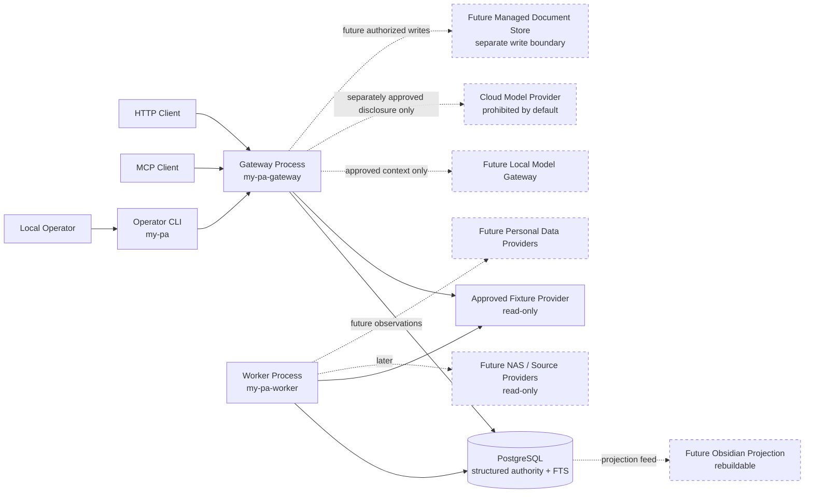
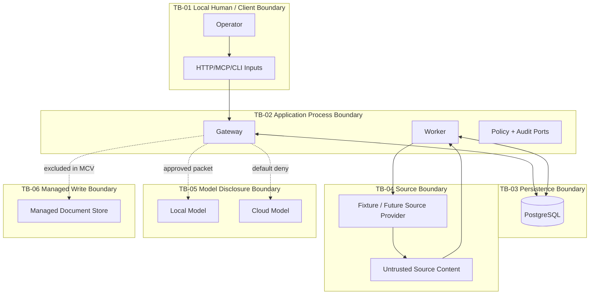
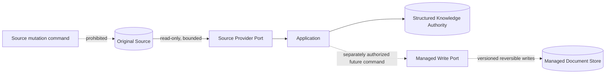

# System Context

## 1. Purpose and status

`my-pa` is the proposed local-first Personal Knowledge Layer between a local operator, authorized source systems, structured knowledge storage, and model-facing retrieval interfaces. Its first credible outcome is one bounded read-only vertical slice, not a general automation platform.

This document refines the accepted foundation in ADR-001 and ADR-002. It does not authorize executable code, NAS/database access, managed writes, deployment, production activation, or risk acceptance. The authenticated authoring basis is `main@3e6f7218b424f8f7dc6c5bac78956dfffe0cb8ae`; the exact tree SHA and local worktree state remain unavailable.

## 2. Actors and external systems

| ID | Context element | Role | MCV state | Authority boundary |
|---|---|---|---|---|
| `CTX-PKL-001` | Local operator | Selects approved fixture scope, invokes CLI/gateway, reviews limitations | Active | Human operator-only decisions remain explicit |
| `CTX-PKL-002` | HTTP/MCP client | Calls public read-only capabilities | Active through synthetic client tests | Never supplies its own authority merely by claiming a principal/purpose |
| `CTX-PKL-003` | Operator CLI | Composition surface for administrative actions | Active | Same application policy as HTTP/MCP; no bypass |
| `CTX-PKL-004` | Gateway process | Request normalization, authorization, query/read coordination | Active | No direct provider/persistence bypass |
| `CTX-PKL-005` | Worker process | Bounded extraction/index/recovery jobs | Active | Executes persisted authorized work only |
| `CTX-PKL-006` | PostgreSQL | Planned canonical structured authority and FTS | Active only in later disposable synthetic implementation | Physical target unresolved; no existing DB access authorized |
| `CTX-PKL-007` | Fixture source provider | Approved bounded read-only source | Active | Original bytes authoritative; adapter cannot mutate |
| `CTX-PKL-008` | NAS/source providers | Future real read-only sources | Later phase | Must receive configured allowed roots; no discovery outside them |
| `CTX-PKL-009` | Local model gateway | Optional context consumer/generator | Later phase | Output is proposed/inferred, never source authority |
| `CTX-PKL-010` | Cloud model provider | External processing boundary | Excluded by default | Raw/private data disclosure prohibited absent separate approval |
| `CTX-PKL-011` | Managed-document store | Separate write-authority capability | Excluded from MCV | Writes require separate operator authorization and transactions |
| `CTX-PKL-012` | Obsidian projection | Rebuildable human-facing view | Later phase | Derived projection, never canonical authority |
| `CTX-PKL-013` | Email/calendar/contact providers | Personal-data observations | Fixture provider in scope; live access excluded | Separate authorization, privacy, and provider contracts required |
| `CTX-PKL-015` | Local operator as author | Creates user-authored records through the capture contract | Active under ADR-003 | Authors evidence the product owns; authoring is neither source mutation nor a managed write |
| `CTX-PKL-014` | Public research providers | External evidence collection | Excluded | No public research or automated profiling in MCV |

## 3. Current versus target context

### 3.1 Authenticated current repository state

The current repository is no longer a documentation-only scaffold; that sentence was true when this document was authored and is not true now. The `my_pa` package implements the public `v1` contracts, the domain identity, policy, audit, source, extraction, and search models, PostgreSQL persistence for the source registry, bounded enrollment, jobs, extraction, quarantine, coverage, and lexical search, and a read-only fixture source provider. Alembic owns the schema history at eight revisions, head `8b3f5c17d904`. What still does not exist is composition: no application service binds a capability to that behavior, and no gateway, worker, or transport process runs. [`../../README.md`](../../README.md) holds the current inventory and is the file to correct when this drifts again.

### 3.2 MCV target context

The smallest target introduces one internal application/domain model and three composition surfaces:

- `my-pa-gateway`: HTTP and MCP adapters over the same application use cases;
- `my-pa-worker`: durable bounded extraction/index/recovery execution;
- `my-pa`: operator CLI for administrative use cases.

All three share the same public/domain contracts and policy decisions. PostgreSQL holds structured metadata, provenance, audit, operation/jobs, coverage, extracted text, and lexical indexes. A fixture provider is the only active source boundary. No model is required to complete the MCV.

### 3.3 Later target context

Later phases may add a verified NAS provider, managed-document store, personal connectors, knowledge lifecycle, context assembly, relationship intelligence, and projections. These remain future context, not implied MCV components.

## 4. Context diagram

Solid edges are MCV-active conceptual flows. Dashed edges are later-phase or excluded until separately authorized.

## 5. Trust boundaries

- `TB-01`: All input is untrusted until authenticated, normalized, validated, and authorized.
- `TB-02`: Gateway and worker are separate processes but not separate services/domains. Neither may bypass application policy, provenance, or audit responsibilities.
- `TB-03`: PostgreSQL is trusted for structured state only after a later authorized disposable-database implementation validates migrations and configuration. The physical production/existing database remains unknown.
- `TB-04`: Source adapters and content are untrusted. Containment, type/signature, size, version, and parser controls apply. Retrieved text is never instruction authority.
- `TB-05`: Model processing is a disclosure boundary. Local is not automatically unrestricted; cloud is prohibited for raw/private MCV data by default.
- `TB-06`: Managed writes are a distinct authority and transaction boundary and are not present in the MCV.

## 6. MCV data flows

### `DF-PKL-001` — Capability discovery

Client → gateway → application capability registry → policy-filtered response. The registry reports supported contracts and configured limits without internal topology or secrets.

### `DF-PKL-002` — Source list/metadata/fetch

Client → gateway/CLI → application use case → policy → source-provider port → fixture adapter → normalized result → disclosure envelope. Stable opaque IDs cross the public boundary; physical/provider identity does not.

### `DF-PKL-003` — Enrollment

Operator → CLI/gateway → authorization → normalized bounded enrollment → PostgreSQL operation/job/audit records. Enrollment permits bounded reads; it does not grant source mutation.

### `DF-PKL-004` — Extraction and indexing

Worker leases authorized work → adapter revalidates object containment/version → reads bounded bytes → validates media and resource limits → extracts or quarantines → persists source/version/provenance/coverage/text/FTS/audit atomically or through documented idempotent stages.

### `DF-PKL-005` — Search and read

Client → gateway → authorization/purpose/scope → PostgreSQL FTS or record read → disclosure assembly → transport adapter. Search coverage and freshness are explicit; a missing result is not evidence that unindexed scope contains no match.

### `DF-PKL-006` — Model context, later only

Authorized retrieval result → policy/classification/purpose filter → field-level disclosure packet → local model. Cloud transmission remains denied until a separate operator-approved data eligibility policy and auditable receipt exist.

## 7. Authority boundaries

| Boundary | Read authority | Mutation authority | MCV rule |
|---|---|---|---|
| Original source | Explicit approved scope only | None | Fail closed on uncertain containment or version |
| PostgreSQL structured records | Application use cases | Application-owned transactions in disposable DB after authorization | No direct transport/adapter writes |
| Enrollment/policy | Operator request plus policy | Application transaction | Operator-only; request flag is insufficient |
| Extracted text/search index | Authorized scope | Worker/application only | Derived and source-version-bound |
| Audit records | Authorized reviewers/operators | Append-only application behavior | Security-relevant audit failure is fail-closed |
| User-authored records | Owning principal within policy | Owning principal, append-only, through an application command | Immutable versions; no update or delete path; not a managed write |
| Managed documents | Excluded | Excluded | Separate later capability and authorization |
| Projection | Later read | Rebuild only | Never canonical |
| Model output | Later proposal/inference read | Proposal store only after separate lifecycle exists | Cannot mutate source/facts/policy |

## 8. Deployment-neutral interfaces

Architecture documents define ports and contracts, not deployment topology:

- public capability request/response contracts;
- source-provider read-only port;
- repository/unit-of-work ports for structured state;
- job lease/operation port;
- policy decision port;
- audit event port;
- extractor port with bounded input/output and typed result;
- disclosure assembler;
- clock/ID generators for determinism.

The initial implementation may compose these inside two Python processes and one CLI. Ports do not imply remote services. A split requires measured scaling, isolation, security, ownership, or deployment need and a new ADR.

## 9. Read-only source versus managed-write boundary

Source providers expose only list, metadata, bounded fetch, status, and version/fingerprint behavior. They do not expose write methods in MCV contracts. Managed-document writing later uses a separate port, root, transaction, authorization, versioning, retention, and recovery design. The two cannot share a generic read/write provider that allows accidental source mutation.

## 10. Local and cloud model boundary

- No model is required for MCV correctness.
- Retrieved source content is untrusted data and may contain prompt or indirect tool injection.
- Model requests must be assembled from explicitly allowed fields after classification, purpose, and policy evaluation.
- The default is `cloud_eligible=false` for raw/private content.
- Cloud processing requires a future operator decision specifying provider, account/container, purpose, field allowlist, retention/training terms, redaction, audit receipt, and revocation.
- Model output is labeled `proposal` or `inference`, source-referenced where possible, and cannot silently become canonical fact or authorize an action.

## 11. Failure and unavailable-evidence behavior

- Identity, scope, source containment, authorization, or policy ambiguity results in denial or unavailable state, not best-effort expansion.
- A failed source/provider/database/extractor returns typed state and disclosed limitations.
- Partial extraction/search results identify exact bounded counts and unavailable/quarantined/unsupported evidence.
- A changed source version during processing produces conflict/quarantine; mixed-version output is not accepted.
- Missing audit persistence for an operator-only or security-relevant action is fail-closed.
- Current repository tree SHA, local worktree status, live NAS behavior, physical database identity, and runtime state are unavailable and are not claimed by this package.

## 12. Architecture invariants

- `SC-INV-001`: One repository and one modular Python codebase until a measured split trigger exists.
- `SC-INV-002`: Gateway, worker, and CLI share application/domain contracts and policy semantics.
- `SC-INV-003`: Original sources are authoritative and read-only by default.
- `SC-INV-004`: Managed writes are separate and excluded from the MCV.
- `SC-INV-005`: PostgreSQL is planned structured authority; FTS/`pg_trgm` precede vector/graph infrastructure.
- `SC-INV-006`: Progressive enrollment only; no automatic full-source discovery.
- `SC-INV-007`: Public contracts remain provider-, transport-, ORM-, path-, host-, and database-neutral.
- `SC-INV-008`: Obsidian and other projections are deterministic/rebuildable and noncanonical.
- `SC-INV-009`: Model output is nonauthoritative and policy-constrained.
- `SC-INV-010`: Unknown/unavailable/partial state is preserved truthfully.
- `SC-INV-011`: Runtime roots are configured; future operator NAS access uses `ssh bf-nas`, never the deprecated alias.
- `SC-INV-012`: User-authored records are product-owned and append-only, and are neither source mutation nor managed-document writes.
- `SC-INV-013`: No composite relationship score exists, and no protected- or sensitive-trait inference exists at all. Transparent single-basis indicators are permitted and each states its calculation basis and time window.
- `SC-INV-014`: A canonical person is established only through governed identity resolution; merge and split are reversible and review-required.

## 13. Context acceptance criteria

- `SC-AC-001`: The context identifies every required current/future/excluded actor and component and labels MCV activation state.
- `SC-AC-002`: Diagrams and text preserve modular monolith, gateway/worker/CLI, PostgreSQL, source/managed-write, model, and projection boundaries.
- `SC-AC-003`: Every external boundary has an explicit trust/authority rule and failure behavior.
- `SC-AC-004`: No excluded provider, connector, model, write path, or deployment component becomes an MCV commitment.
- `SC-AC-005`: The context is consistent with the MCV specification, module boundaries, data authority, and threat model.

## 14. Alternatives rejected for the MCV

- **Microservices:** rejected because no measured scaling, isolation, ownership, or deployment requirement exists.
- **Generic read/write provider framework:** rejected because it weakens the source/managed-write authority boundary.
- **Graph/vector-first architecture:** rejected because PostgreSQL lexical search is sufficient for the first slice and quality has not been benchmarked.
- **Model-centric authority:** rejected because models are nondeterministic and cannot replace source/provenance/policy authority.
- **Full NAS indexing:** rejected because it expands privacy, cost, and truthfulness risk without a current acceptance criterion.

## 15. Invalidation and next gate

This document is invalidated by a material change to ADR-001/ADR-002, composition roots, public capability set, source/managed-write boundary, structured authority, model-disclosure policy, or MCV scope. Integration requires a separately authorized repository document change against a fresh exact head/tree and clean worktree, index updates, link checks, and independent exact-head review.

## 16. Related documents

- [`../specs/mcv-read-only-vertical-slice.md`](../specs/mcv-read-only-vertical-slice.md)
- [`module-boundaries.md`](module-boundaries.md)
- [`data-authority.md`](data-authority.md)
- [`../security/threat-model.md`](../security/threat-model.md)
- [`../../PHASE-00-OPEN-DECISION-LEDGER.md`](../../PHASE-00-OPEN-DECISION-LEDGER.md)
