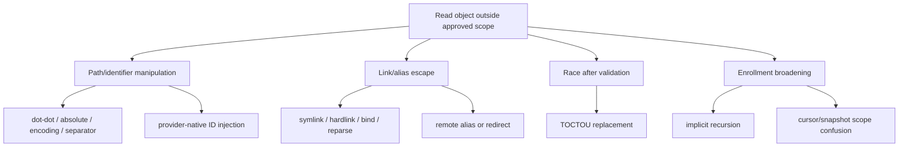
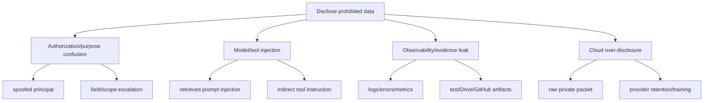
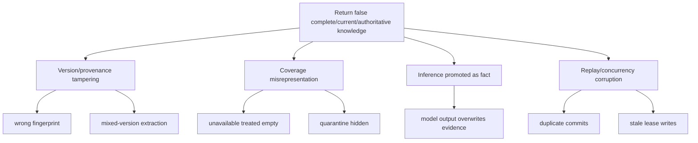

# Threat Model — MCV Read-Only Vertical Slice

## 1. Conclusion and status

The proposed MCV can be implemented with a bounded attack surface if it remains fixture-first, read-only, local-first, deny-by-default, and free of required model, cloud, vector, graph, managed-write, personal-connector, and production dependencies. The highest-risk boundaries are source containment/identity, untrusted parser/content handling, authorization/purpose/disclosure, truthful coverage/provenance, and sensitive logging/evidence.

This document identifies risks and required controls. It does not accept residual risk, authorize implementation, approve a parser/dependency, permit live source/database/personal-data access, or satisfy independent security review. Authenticated repository basis is `main@3e6f7218b424f8f7dc6c5bac78956dfffe0cb8ae`; exact tree SHA and local worktree state are unavailable.

## 2. Scope

### In scope

- Twelve `v1` public capabilities and equivalent HTTP/MCP/CLI semantics. Eight are read-only. The four `capture.*` capabilities write a **product-owned** record, which `ADR-003` clause 5 makes a third authority class: neither a source-system write nor a managed-document write, and it grants the read-only source-provider port no write method. "Read-only" therefore describes what this build does to *sources*, which is the property the rest of this document is about, and no longer describes the whole capability set.
- Operator-only bounded enrollment.
- Fixture source provider and constraints that later apply to a NAS provider.
- Source list/metadata/fetch, text/Markdown extraction, decision-gated PDF extraction, quarantine, coverage, PostgreSQL FTS, knowledge search/read.
- Planned PostgreSQL structured authority, jobs/leases/outbox, policy, audit, provenance, and disclosure.
- Synthetic tests, disposable PostgreSQL, dependency/workflow supply chain, and redaction.
- User-authored capture: create, version, read, list, and exact search over text the operator types into the product.
- Deterministic extraction over capture text, span validation, proposals, and governed review and promotion.
- Relationship identity, unresolved mentions, and read-only profiles over a fixture personal-source provider.

### Excluded but considered as future hazards

Live NAS, existing database, **live** personal connectors, managed writes, model/cloud processing, projections, public research, **relationship synthesis and scoring**, autonomous action, deployment, and production. These are deferred boundaries requiring separate threat-model updates and authorization; they are not accepted risks.

## 3. Assumptions and unavailable evidence

### Assumptions

- Repository governance and ADR-001/ADR-002 remain authoritative.
- Standard tests use synthetic fixtures and disposable databases only.
- Future secrets are supplied through a least-privilege external mechanism and are not committed.
- MCV source adapters expose no mutation methods.

### Unavailable evidence

- Current commit tree SHA and operator-local worktree/dirty/untracked state.
- Live runtime, OS sandbox, filesystem/mount behavior, NAS configuration, approved roots, and `ssh bf-nas` canary evidence.
- Physical DB identity, credentials, schema, backup/restore, and network posture.
- Exact parser dependency/version/CVE/license/sandbox/resource/malformed-corpus evidence.
- HTTP/MCP authentication and deployment configuration.
- Cloud provider/account/retention/training/data eligibility; cloud disclosure therefore remains prohibited.

## 4. Security objectives

- `SEC-OBJ-001`: Confidentiality of source content, queries, identities, paths, credentials, DB/host details, and personal information.
- `SEC-OBJ-002`: Integrity/immutability of original sources; no MCV source mutation.
- `SEC-OBJ-003`: Consistent principal, purpose, capability, scope, classification, and destination authorization.
- `SEC-OBJ-004`: Provenance, version/fingerprint, authority state, and auditability of derived records.
- `SEC-OBJ-005`: Truthful unavailable, unsupported, stale, partial, conflicting, quarantined, and superseded state.
- `SEC-OBJ-006`: Containment of untrusted files/parsers/retrieved text so they cannot become commands or widen authority.
- `SEC-OBJ-007`: Bounded CPU, memory, I/O, DB, parser, job, and transport consumption.
- `SEC-OBJ-008`: Fail-closed behavior and safe errors.
- `SEC-OBJ-009`: Reviewable/reproducible dependencies, workflows, evidence, and exact identities.

## 5. Assets

| ID | Asset | Security need |
|---|---|---|
| `ASSET-PKL-001` | Original source bytes/metadata | Private, source-authoritative, immutable from MCV |
| `ASSET-PKL-002` | Approved root/scope and provider identity mappings | Security-critical; disclosure enables bypass/reconnaissance |
| `ASSET-PKL-003` | Extracted text/snippets/query results | Private, derived, source-version-bound |
| `ASSET-PKL-004` | Enrollment/policy/classification/purpose/authorization | Critical integrity |
| `ASSET-PKL-005` | Provenance/coverage/freshness/trust/limitations/quarantine | Truthfulness/integrity critical |
| `ASSET-PKL-006` | PostgreSQL records/migrations/FTS/jobs/outbox | Structured integrity/availability |
| `ASSET-PKL-007` | Audit/evidence | Tamper-resistant, redacted, identity-bound |
| `ASSET-PKL-008` | Secrets/credentials/DB URLs/host details | Highly restricted; never stored/logged |
| `ASSET-PKL-009` | Public contracts/opaque IDs | Integrity/compatibility/no topology leak |
| `ASSET-PKL-010` | Dependency/workflow/repository identity | Supply-chain/exact-head assurance |
| `ASSET-PKL-011` | User-authored capture text and its version chain | Private, immutable, product-owned; loss or silent rewrite destroys evidence that exists nowhere else |

## 6. Actors and threat actors

Legitimate actors are the local operator, authenticated HTTP/MCP client, gateway, worker, CLI, PostgreSQL, fixture provider, and future independent reviewer.

Threat actors/adverse conditions include malicious or compromised local clients; malicious source-file authors/content; compromised provider/parser/dependency/workflow; operator/policy/root/deployment/DB misconfiguration; stale/replayed workers/requests; retrieved prompt/tool injection; external/cloud over-disclosure; logs/errors/metrics/evidence leaks; and resource exhaustion.

## 7. Entry points and trust boundaries

| ID | Entry point | Untrusted input |
|---|---|---|
| `EP-PKL-001` | HTTP | Headers, auth context, JSON, query, cursor, cancellation |
| `EP-PKL-002` | MCP | Tool name/arguments, model-originated content, session context |
| `EP-PKL-003` | CLI/config | Arguments, environment, config, operator mistakes |
| `EP-PKL-004` | Source provider | Paths/IDs, metadata, bytes, links, races, remote errors |
| `EP-PKL-005` | Extractor/parser | Bytes, media claims, embedded objects, malformed structures |
| `EP-PKL-006` | PostgreSQL | Config, migrations, query input, concurrency, restored data |
| `EP-PKL-007` | Worker lease | Replay/stale/duplicate work, cancellation, poison input |
| `EP-PKL-008` | Model boundary | Retrieved text, templates, tool descriptions, cloud destination |
| `EP-PKL-009` | Logs/evidence/publication | Payloads, paths, IDs, secrets, queries, stack traces |
| `EP-PKL-010` | Repo/dependency workflow | PRs, Actions, packages, lockfiles, upstream compromise |
| `EP-PKL-011` | Capture create, version, and sync | Free-form operator text, pasted third-party content, client timestamps, idempotency keys, launch context, batch payloads |

Trust boundaries are client/operator, application processes, persistence, source/content, model disclosure, and future managed writes, as defined in `../architecture/system-context.md`.

## 8. Misuse and abuse cases

- `ABUSE-PKL-001`: Use traversal, alternate separators, encodings, absolute/device paths, or provider aliases to escape root.
- `ABUSE-PKL-002`: Swap symlink/hardlink/bind/reparse/provider object between validation and read.
- `ABUSE-PKL-003`: Enroll a broader root/depth/item set/wildcard/pagination sequence than intended.
- `ABUSE-PKL-004`: Supply malformed/PDF/archive-like content to exploit/crash parser or exhaust resources.
- `ABUSE-PKL-005`: Embed instructions telling a model/client to reveal secrets, invoke tools, change policy, or fetch outside scope.
- `ABUSE-PKL-006`: Escalate local read purpose to export/cloud/model/write/source action.
- `ABUSE-PKL-007`: Spoof principal/source/object/version IDs or tamper cursor/idempotency/job/audit state.
- `ABUSE-PKL-008`: Hide failed/unindexed/quarantined objects so partial search appears complete.
- `ABUSE-PKL-009`: Leak content/query/path/credentials through logs, telemetry, tests, Drive, or PR artifacts.
- `ABUSE-PKL-010`: Replay jobs/requests to duplicate extraction, widen enrollment, or corrupt coverage/audit.
- `ABUSE-PKL-011`: Target unresolved existing physical DB and cause unintended schema/data mutation.
- `ABUSE-PKL-012`: Introduce compromised dependency or mutable Action that exfiltrates data.
- `ABUSE-PKL-013`: Exhaust service with expensive FTS, huge pages/files, deep traversal, retries, or operations.
- `ABUSE-PKL-014`: Future managed-write path reuses source credentials/root and overwrites evidence.
- `ABUSE-PKL-015`: Paste content whose embedded instructions a later extraction stage or model treats as commands rather than as evidence.
- `ABUSE-PKL-016`: Edit a capture so a span supporting an accepted downstream record no longer matches, leaving that record standing on text that no longer says it.
- `ABUSE-PKL-017`: Reuse an idempotency key with different content to overwrite or duplicate user evidence.
- `ABUSE-PKL-018`: Route around the promotion path so a proposal reaches canonical without a review disposition.
- `ABUSE-PKL-019`: Persist a relationship score, ranking, or protected-trait conclusion through an extraction or profile field.

## 9. Attack-tree summaries

### Escape approved source scope

### Exfiltrate sensitive data

### Corrupt knowledge truth

## 10. Required controls

### 10.1 Traversal, allowlist bypass, links, TOCTOU

- Public contracts accept opaque IDs, not paths/provider-native IDs.
- Enrollment begins at configured logical root with explicit objects/bounded depth.
- Canonical provider identity validation; no string-prefix-only checks.
- Reject absolute/traversal/device/special/ambiguous paths and root changes.
- Fail closed on link/reparse/bind/redirect semantics unless containment proven.
- Bind fingerprint/version before read and revalidate at open/commit where feasible.
- Later live credentials/mounts are least-privilege read-only.
- No SSH configuration inspection/change; future canary uses `ssh bf-nas`, while runtime receives roots.

### 10.2 Source mutation

- Source port exposes no mutation methods.
- Read-only credentials/mounts where possible.
- No generic source/managed read-write provider.
- Architecture/static tests prohibit write operations/imports.
- Negative tests attempt create/write/truncate/rename/move/delete/permission actions and require denial/no source change.

### 10.3 Overbroad enrollment and authorization confusion

- `sources.enroll` operator-only through authenticated policy; request flag insufficient.
- Exactly one selector; explicit max depth/items/bytes/types; default depth zero.
- Enrollment/idempotency binds principal, purpose, scope, limits, classification, policy.
- Work derives from persisted authorized enrollment, not caller paths.
- Capability, field, source, object, destination, and purpose checks remain distinct.
- HTTP/MCP/CLI use identical application policy semantics.

### 10.4 Unsafe extraction/parser exploitation

- Validate media signature/type; extension insufficient.
- Bound size/time/memory/output/pages/depth.
- Text/Markdown baseline uses explicit safe decoding/normalization.
- PDF is decision-gated pending dependency, license, security, malformed-input, resource, sandbox, and removal review.
- No archive recursion in MCV.
- Parser receives no source-write handle, credentials, network, unrestricted filesystem, or tool authority.
- Failures/timeouts/crashes/version changes/limit breaches quarantine with safe reasons.
- Maintain malformed/adversarial synthetic corpus and dependency-update regressions.

### 10.5 Prompt injection and indirect tool injection

- Retrieved content/metadata are untrusted data, never instructions.
- No model required for MCV correctness.
- Future context packets use fixed policy, structured fields, source labels, classification, field allowlists.
- Retrieved text cannot invoke tools, change policy, select sources, disclose secrets, or authorize action.
- Tool authorization is independent of model text; autonomous action excluded.
- Detection is defense-in-depth, not primary control.
- Model output remains proposal/inference, never silent fact.

### 10.6 Data exfiltration and cloud disclosure

- `cloud_eligible=false` by default; cloud excluded from MCV.
- Future cloud use requires operator-approved provider/account, purpose, fields, classification, retention/training terms, redaction, audit receipt, revocation.
- Public/context outputs exclude paths, provider IDs, hosts, DB details, credentials, unnecessary content.
- Bound output fields/size; no bulk export capability.
- Later deployment should deny unapproved egress.

### 10.7 Identity/provenance/authority tampering

- Derive principal from authenticated context, not caller value alone.
- Type-scoped opaque IDs resolved server-side under policy.
- Persist fingerprint/version, extractor/version, operation, principal, purpose, policy, audit.
- DB constraints/application states prevent cross-type/scope substitution.
- Models/providers cannot self-promote or alter authority.
- Errors avoid denied-object existence leaks.

### 10.8 Coverage/freshness/partial/conflict confusion

- Mandatory disclosure with exact scope/counts.
- Distinguish `not_enrolled`, `eligible`, `processed`, `unsupported`, `quarantined`, `unavailable`, `stale`, `conflicting`, `superseded`.
- Search cannot claim absence beyond indexed coverage.
- Version conflicts reject/quarantine mixed results.
- Cursors bind principal/scope/query/order/snapshot/policy.
- Transport cannot suppress partial state.

### 10.9 Log/evidence/query/secret/path leakage

Default logs/audit/evidence exclude message/document bodies, extracted text, snippets, contact details, query text, credentials/tokens/keys/DB URLs, hosts, physical/share/mount/provider identities, personal paths, and raw stack traces.

Use correlation IDs, opaque IDs, event types, outcome categories, bounded counts/durations, and redacted reasons. Debug mode cannot disable redaction. Fixtures contain no real personal data or realistic secrets.

### 10.10 Dependency/supply-chain compromise

- Minimal dependencies with current need, maintenance/security/license/removal review.
- Immutable Action SHAs and least permissions.
- Reproducible Python lock/constraints with first implementation PR.
- Review dependency changes/advisories; no silent vulnerability suppression.
- Retain package inventory/SBOM when release risk warrants.
- Exact-head review; later commits invalidate affected conclusions.
- No unreviewed build hooks/parser plugins.

### 10.11 Replay, audit tampering, concurrency

- PostgreSQL job IDs/idempotency/leases/attempts/expected-state transitions.
- Atomic claim; stale lease holder cannot commit without version/state check.
- Bounded retry; poison work quarantine.
- Cancellation audited; replay cannot widen enrollment.
- Audit append-oriented; corrections linked; delete/overwrite separately authorized.
- Security-relevant state changes fail closed on audit failure.

### 10.12 Denial of service

Bound page size, source depth/items/bytes, file size, parser time/memory/output, query length/complexity, response size, concurrent jobs, retries, and operation rate. Use cursors, bounded snippets, parameterized/time-bounded DB operations, bounded worker concurrency, no recursive discovery/retry loops, and low-cardinality payload-free metrics.

### 10.13 Managed writes (implemented by WP-27, seated and exposed by WP-28)

No longer excluded, and the conditions this section set are met rather than waived. A designated managed root separate from every source root and refused if it is, contains, or lies inside one after resolution; expected-version preconditions; immutable versions enforced by `BEFORE UPDATE OR DELETE` triggers; a reversible archive that destroys nothing; backup and restore exercised against a live server; per-Principal idempotency; and no reuse of the read-only source port, which has no write method to reuse. Operator authorization for pointing the plane at real storage remains `EXT-10`.

**Audit.** Six `documents.` capabilities under two purposes of their own reach the plane through `ApplicationService.invoke`, so every managed request writes a `knowledge.audit_events` row on the audit sink's own connection, committed before the handler runs and therefore surviving a rollback of the work. A policy refusal records `denied` with its reason. A refusal raised by the handler — a stale expected version, a rebound idempotency key, a document another Principal owns — leaves a durable row recording `outcome='allowed'`, because authorization was granted and that remains true: `outcome` carries the **authorization decision** and not the result of the work, which is `invoke`'s pre-existing semantics for every capability rather than anything this plane introduced. Nothing writes a second event to say the work then failed, here or anywhere else.

**No identifier joins an audit row to what landed, and this is the residual.** No `managed_*` table carries an `audit_id` or a `request_id`. The `correlation_id` on `managed_document_versions`, `managed_document_submissions` and `managed_document_lifecycle_events` is minted inside `ManagedDocumentService` and is a *different value* from the `correlation_id` on the `audit_events` row written for the same request; neither is passed to the other. Correlating an attempt with its effect is therefore **heuristic** — same `principal_id`, same capability, adjacent timestamps — which is enough for an operator reconciling one request on a single-operator process and is not enough to prove anything. It must close before `EXT-08`: once a non-operator client drives this surface the audit is the only record of what that client did, and an inference is not a trail. Recorded here as an open prerequisite of external client activation rather than described as outcome auditing that exists.

**Containment against a check-to-syscall race.** Every write and every read is performed relative to a directory descriptor obtained by walking the chain once with `O_DIRECTORY | O_NOFOLLOW`. WP-27's disclosed intermediate-component TOCTOU — a directory component swapped between the containment check and the syscall, which landed bytes outside the root while `put` reported success — is closed by this and is reproduced-then-refused in `tests/security/test_managed_store_toctou.py`. The managed root itself is opened by name — once for every anchored step rather than once per public call, which is five times during a single `put` — and is the one component no descriptor sits above.

**Transport.** stdio only, no socket, no credential. The surface has a kill switch that empties `tools/list` and refuses `tools/call`, and may be bound to a registered client whose revocation withdraws it. **No OAuth authorization server, no PKCE, no resource indicators and no per-client profile conformance exist**, because no ingress exists to carry them; `EXT-07`/`EXT-08` remain operator-gated. Threat model update and independent review remain mandatory before any ingress is activated.

### 10.14 User-authored records

- Stored text is append-only. There is no update or delete path to attack.
- The save transaction commits capture, version, receipt, redacted audit, and the enqueued processing job together or commits nothing. Required audit or receipt failure fails the save closed rather than reporting a save that did not durably happen.
- Idempotency binds principal, operation, and a request hash. A reused key with a different request is a conflict, never a silent overwrite and never a duplicate.
- Every derived record cites at least one span into an exact version, re-validated before the record is shown. A mismatch quarantines.
- A source edit that materially changes a cited span moves the supported accepted record to `revalidation_required`. It is neither silently kept nor silently rewritten.
- Capture text never appears in logs, audit rows, telemetry, event payloads, error bodies, URL parameters, or notification previews.
- Captured and pasted text is evidence data. Extraction runs with no tool authority at all, so there is nothing for an injected instruction to reach.
- Consequential proposals cannot reach canonical without an explicit review disposition.
- No composite relationship score and no protected-trait field exists in any schema or contract, enforced by a static test rather than by review attention.

### 10.15 Remote OAuth refresh-token families

Origin OAuth issues one-hour opaque access tokens. Refresh tokens are optional,
rotating, digest-only, and bound to one client, resource, and scope ceiling.
`refresh_enabled` defaults false. Replay of a consumed generation revokes the
family and linked live access tokens. Capability grants, write kill switches,
and global remote enablement are re-evaluated at refresh and on every request;
they are not frozen into refresh state. Logs and telemetry never carry token
values, digests, codes, or secrets. See
[`ADR-009`](../decisions/ADR-009-oauth-refresh-token-families.md).

## 11. Fail-closed and safe errors

- Ambiguous identity/scope/purpose → `ambiguous_request` or `denied`.
- Unproven containment/version → `denied`, `conflict`, or quarantine.
- Unsupported media/parser → `unsupported`, never empty success.
- Source/DB/policy/audit unavailable → `unavailable`; protected commands fail closed.
- Partial failures → explicit partial disclosure/counts.
- Internal exceptions → generic external `internal_error` plus redacted internal event.
- Denied/not-found avoid existence side channels.
- Errors never contain paths, credentials, queries, hosts/DB, provider IDs, content, or stack traces.

## 12. Security test strategy

Standard tests use small synthetic fixtures and disposable DBs only—no live personal account, NAS content, existing DB, production credential, or external model.

Required negative tests:

- traversal encodings/separators/absolute/device paths/prefix collisions;
- symlink/hardlink/reparse/bind/redirect escape and simulated TOCTOU/version swap;
- forged opaque IDs/cross-type substitution;
- depth/item/byte/wildcard/empty/ambiguous enrollment;
- all prohibited mutation verbs;
- malformed/oversized/mislabeled text; PDF malformed/resource corpus after selection; archive unsupported behavior;
- prompt/indirect tool injection in content/metadata/snippets;
- private cloud request;
- purpose escalation and HTTP/MCP/CLI policy-equivalence failures;
- partial/unavailable/quarantine/stale/conflict representation;
- logs/artifacts contain no prohibited fields;
- SQL/query injection/pathological FTS;
- duplicate/replayed enrollment/job, stale lease, cancellation, retry exhaustion;
- audit-write failure for protected actions;
- config unknown fields and secret-like fixture scanning.

## 13. Threat-to-control-to-test matrix

| Threat ID | Threat | Controls | Test evidence | Phase |
|---|---|---|---|---|
| `T-PKL-001` | Traversal/allowlist bypass | Opaque IDs, canonical containment, no path input | traversal corpus denied/no leak | 01/03/05 |
| `T-PKL-002` | Link/TOCTOU escape | safe resolution, version revalidation, quarantine | link/race simulations | 03/04 |
| `T-PKL-003` | Source mutation | read-only port/credentials/no writes | mutation attempts denied/source unchanged | 01/03/05 |
| `T-PKL-004` | Overbroad enrollment | operator policy, explicit limits/idempotency | escalation denied | 01/02/04 |
| `T-PKL-005` | Parser exploit/resource bomb | signature/limits/isolation/quarantine | malformed/resource corpus | 04 |
| `T-PKL-006` | Prompt/tool injection | content-as-data/no model dependency/tool separation | injection cannot alter action/scope | 05+ |
| `T-PKL-007` | Data/cloud exfiltration | classification/allowlist/default deny/redaction | cloud denied/field leak tests | 01/05 |
| `T-PKL-008` | Authorization/purpose escalation | common policy/transport equivalence | cross-purpose/transport matrix | 01/05 |
| `T-PKL-009` | Identity/provenance tampering | typed IDs/fingerprint/constraints/audit | forged IDs/mixed-version denied | 01/02/04 |
| `T-PKL-010` | Coverage/partial confusion | mandatory disclosure/states | partial never complete | 01/04/05 |
| `T-PKL-011` | Log/evidence leakage | redaction/synthetic/safe errors | captured outputs clean | 01–05 |
| `T-PKL-012` | Supply-chain compromise | minimal deps/immutable pins/lock/review | dependency/workflow checks | 01–05 |
| `T-PKL-013` | Replay/stale lease | idempotency/leases/expected state | replay/concurrency/recovery | 02/04 |
| `T-PKL-014` | Audit tampering/failure | append/link/fail closed | audit failure blocks command | 02/04/05 |
| `T-PKL-015` | DoS | limits/timeouts/concurrency/rates | max-bound/retry-storm tests | 03–05 |
| `T-PKL-016` | Unknown DB mutation | explicit config/disposable first/no guessing | absent/ambiguous fails closed | 02 |
| `T-PKL-017` | Future write corruption | separate root/version/recovery/auth | deferred pre-Phase 06 | 06 |
| `T-PKL-018` | User evidence lost, duplicated, or silently rewritten | append-only versions, all-or-nothing save, idempotency with request hash | induced audit failure leaves no capture; key reuse conflicts | 06 |
| `T-PKL-019` | Derived record stands on text that changed | span re-validation, quarantine on mismatch, `revalidation_required` | mutate a version and require quarantine or revalidation | 06/07 |
| `T-PKL-020` | Unreviewed proposal becomes canonical | review-required routing by consequence, governed dispositions | direct promotion denied for every consequential class | 07 |
| `T-PKL-021` | Injected instruction in pasted text acts | evidence/instruction separation, no tool authority, schema-constrained output | injection corpus yields bounded proposals or safe failure | 07 |
| `T-PKL-022` | Relationship surveillance behavior | no score, ranking, or trait field; merge review-required; fixtures only | static schema and contract test; direct merge denied | 08 |

## 14. Phase allocation

- **Phase 00:** contracts, authority, threat/control IDs, tests, redaction, cloud default deny; no runtime/risk acceptance.
- **Phase 01:** IDs/states/errors, strict parsing, policy/audit ports, no-leak and architecture tests, safe config.
- **Phase 02:** disposable DB migrations, constraints, jobs/leases/outbox/audit/idempotency; no existing DB.
- **Phase 03:** fixture-provider containment/version/read-only conformance; no live NAS absent separate authorization.
- **Phase 04:** bounded extraction/quarantine/coverage/FTS, parser review/adversarial corpus/recovery.
- **Phase 05:** HTTP/MCP equivalence, authentication/policy/error/disclosure, injection/leak tests.

Later personal connectors, models/cloud, managed writes, relationships, projections, operations, or production require threat-model revision.

## 15. Security acceptance criteria

- `TM-AC-001`: Required boundaries/assets/actors/entry points/abuse/threats identified.
- `TM-AC-002`: Each high/material threat has fail-closed control and negative-test expectation.
- `TM-AC-003`: Traversal/link/TOCTOU, mutation, enrollment, parser, injection, exfiltration, authorization, provenance, coverage, leakage, supply chain, replay/audit, DoS, and future writes covered.
- `TM-AC-004`: Logs/evidence exclude prohibited fields by default.
- `TM-AC-005`: Tests synthetic/disposable; unavailable live evidence not claimed.
- `TM-AC-006`: Residual risks/operator decisions remain open; none accepted.
- `TM-AC-007`: Threat/control/test IDs trace to Phases 01–05.

## 16. Residual risks, owners, evidence, stops

| Residual | Risk | Owner | Evidence before reliance | Stop condition |
|---|---|---|---|---|
| `RR-PKL-001` | Tree/worktree unknown | Operator/local agent | exact head/tree/status/untracked | drift/dirty without instruction |
| `RR-PKL-002` | PDF parser unknown | Operator/implementer/reviewer | dependency review, limits, corpus, exact-head tests | parser required but unreviewed |
| `RR-PKL-003` | Physical DB unknown | Operator | disposable evidence; later exact alias/backup/restore auth | attempt to guess/connect/migrate |
| `RR-PKL-004` | Live source semantics unknown | Operator | separate canary/read-only proof | live access needed now |
| `RR-PKL-005` | HTTP/MCP auth undeveloped | Operator/reviewer | chosen auth/threat update/tests | exposure beyond local test |
| `RR-PKL-006` | Cloud posture unknown | Operator/privacy/security | provider/purpose/fields/terms/audit | any private cloud request |
| `RR-PKL-007` | Dependency vulnerabilities evolve | Maintainer | lock/advisories/review/CI | unresolved material vulnerability |
| `RR-PKL-008` | No independent exact-head review | Operator/reviewer | review of integrated diff/head | treat package as accepted/merged |
| `RR-PKL-009` | No model boundary decision exists, so model-assisted extraction is unspecified | Operator | model gateway design, `P00-OD-006` resolution, isolation and retention evidence | any model call is proposed |
| `RR-PKL-010` | Retention and deletion for user-authored content is undecided | Operator | `O-10` resolution with backup, privacy, and recovery evidence | any hard delete |
| `RR-PKL-011` | A fixture personal-source provider is not evidence about a real connector | Operator/implementer | separate connector authorization by exact account and scope, and a threat-model revision | any live personal-source read |

This session accepts no residual risk.

## 17. External guidance basis

External guidance informs but does not supersede project controls:

- OWASP LLM Prompt Injection Prevention Cheat Sheet: https://cheatsheetseries.owasp.org/cheatsheets/LLM_Prompt_Injection_Prevention_Cheat_Sheet.html
- OWASP File Upload Cheat Sheet: https://cheatsheetseries.owasp.org/cheatsheets/File_Upload_Cheat_Sheet.html
- NIST SP 800-218 SSDF v1.1: https://csrc.nist.gov/pubs/sp/800/218/final
- MITRE CWE-22 Path Traversal: https://cwe.mitre.org/data/definitions/22.html
- MITRE CWE-367 TOCTOU: https://cwe.mitre.org/data/definitions/367.html

## 18. Invalidation and next gate

Material change to capabilities, authentication, provider/root, parser, DB target, cloud/model use, managed writes, personal connectors, deployment, or production topology invalidates this threat model. Next gate is repository integration against fresh exact identity, independent exact-head security/document review, and later phase-specific evidence. Drive publication does not authorize or accept risk.

## 19. Related documents

- [`../specs/mcv-read-only-vertical-slice.md`](../specs/mcv-read-only-vertical-slice.md)
- [`../architecture/system-context.md`](../architecture/system-context.md)
- [`../architecture/module-boundaries.md`](../architecture/module-boundaries.md)
- [`../architecture/data-authority.md`](../architecture/data-authority.md)
- [`../../PHASE-00-OPEN-DECISION-LEDGER.md`](../../PHASE-00-OPEN-DECISION-LEDGER.md)
