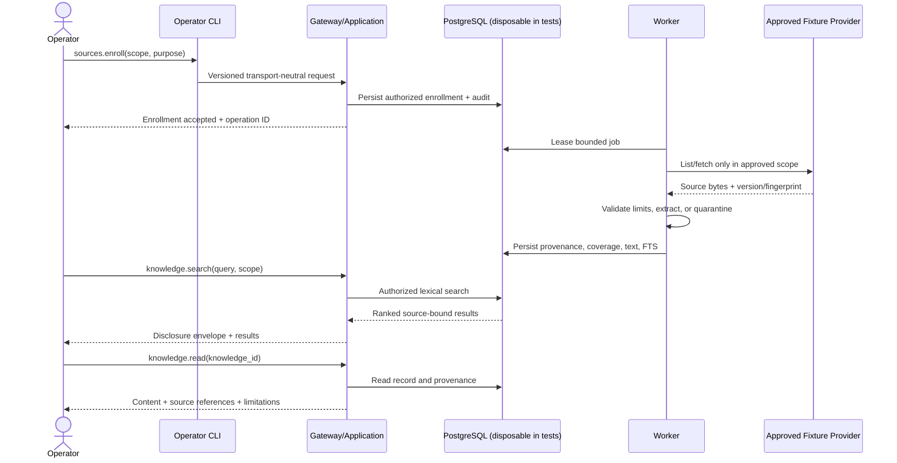

# MCV Read-Only Vertical Slice Specification


## 1. Status, purpose, and authority


This document defines the proposed minimum credible version (MCV) contract for the Personal Knowledge Layer in `RMF112018/my-pa`. It is repository documentation, not executable implementation, repository authority, risk acceptance, or activation approval.


This document was authored against `main@3e6f7218b424f8f7dc6c5bac78956dfffe0cb8ae` from a Phase 00 planning basis of `b8563870afcf87b63e4cde6e0a48bfc59f0bd5b7`, and was integrated into the repository afterwards. The front matter now records the reconciled basis, `main@e773e6f2285da9e453a8ca7e11bdac23619aaf22`, tree `0c726df770c5be7581a7106bf1e399e1f0ea1e98`, verified locally on 2026-08-01. That reconciliation touched only this section and the front matter; the rest of the document was unchanged from the integrated text.

**That is no longer true, and this paragraph is the record of when it stopped being true.** On 2026-08-02 the normative sections were amended for the first time, against `main@8274d88a6211c417c43d2d937edfe2c8ccc369be`, tree `89d2d298bb9fed459360e025fb94a4696b41b24b`. Sections 5, 6, 16, and 18 changed; the version moved to 0.2.0. The amendment follows an operator reprioritization of the objective on 2026-08-01 admitting Relationship Intelligence and Quick Capture, and [ADR-003](../decisions/ADR-003-product-owned-user-authored-source-records.md), which is what permits the second of those to cross section 4 of `AGENTS.md`. Nothing was removed to make room: every exclusion that still holds is still stated, and the two that narrowed say what they narrowed to.

Any later change to this document must revalidate the exact current head, tree, branch, worktree, and dirty/untracked state.


Repository-local governance, accepted ADRs, and authenticated repository state govern over this document. This candidate is invalidated by a material change to the product objective, architecture boundaries, accepted ADRs, public capability set, authority model, disclosure policy, or repository basis.


### 1.1 Governing and supporting sources


- `AGENTS.md`, `CONTRIBUTING.md`, `SECURITY.md`, `docs/00_REPOSITORY_SOURCE_INDEX.md`, ADR-001, and ADR-002 in `RMF112018/my-pa`.
- `README-MYPA-KNOWLEDGE-LAYER-IMPLEMENTATION-PLAN.md`, Drive ID `15C1kI-xpcHcKIY50Dm0dIw5SlvR__BRM`.
- `PHASE-00-REPOSITORY-TRUTH-AND-MCV-CONTRACT-FREEZE.md`, Drive ID `1SvVLqvyY1e_2m4JA-ntVpwcw8E3EZcvY`.
- Current feature/evidence routing identified in the package manifest.


## 2. Problem statement


Authoritative files and later knowledge records can be difficult to discover, inspect, and retrieve without losing the distinction between original evidence, derived text, structured assertions, model-generated proposals, and unavailable scope. A model-facing interface that returns content without explicit scope, provenance, freshness, coverage, trust, and limitations can overstate what is known and expose source-system details or private data.


The MCV therefore proves one complete, bounded, read-only vertical slice. It does not attempt to build a broad personal-assistant platform.


## 3. Bounded MCV definition


The MCV is complete only when synthetic or explicitly approved non-personal fixture evidence demonstrates:


1. An operator registers/enrolls one explicitly approved fixture/source root without recursive discovery outside the boundary.
2. The system lists, inspects, and fetches bounded source objects through stable opaque identities.
3. The operator enrolls one bounded subtree or explicit object set.
4. The worker extracts supported content, quarantines failures, and records coverage, freshness, trust, provenance, and limitations.
5. PostgreSQL full-text search returns indexed records within enrolled scope.
6. `knowledge.read` retrieves source-bound knowledge through transport-equivalent HTTP and MCP contracts.
7. Negative evidence proves denial of traversal, source mutation, unknown scope, unsupported claims, ambiguous requests, and prohibited disclosure.


The MCV is local-first and single-operator. It may be implemented as one Python modular monolith with separately runnable gateway and worker processes and an operator CLI. It does not require microservices, Redis, Celery, a graph database, dedicated vector database, Kubernetes, autonomous-agent framework, or generalized plugin system.


## 4. Actors, principals, purposes, and trust


| ID | Actor/principal | Permitted MCV purpose | Trust level | Authority |
|---|---|---|---|---|
| `ACT-PKL-001` | Local operator | Configure approved fixture scope, enroll objects, inspect status, run validation | Highest local human authority | May invoke operator-only capabilities; no source-mutation authority |
| `ACT-PKL-002` | Gateway process | Authenticate/authorize requests and expose contracts | Trusted application process | Read/query operations; no provider/DB-policy bypass |
| `ACT-PKL-003` | Worker process | Execute bounded extraction/index jobs | Trusted but constrained | Acts only on persisted authorized work |
| `ACT-PKL-004` | Operator CLI | Administrative composition surface | Trusted local tool | Same policy checks; no bypass |
| `ACT-PKL-005` | Source provider adapter | Translate approved logical object reads | Untrusted boundary adapter | Read-only; physical/provider identity internal |
| `ACT-PKL-006` | PostgreSQL | Planned structured authority for metadata/jobs/provenance/audit/coverage/index | Trusted persistence boundary | No unknown physical DB access authorized |
| `ACT-PKL-007` | Local model gateway | Optional later context consumer | Untrusted output generator | Cannot alter facts/authority/policy/source/action state |
| `ACT-PKL-008` | Cloud model/provider | Excluded by default | External/untrusted | No raw/private disclosure without separate decision |


Purposes are explicit and narrow: `source_inspection`, `bounded_enrollment`, `content_extraction`, `knowledge_search`, `knowledge_read`, `status_observation`, and `security_validation`. A principal may not silently escalate one purpose into another.


## 5. Scope


### 5.1 In scope


- One approved synthetic/local fixture provider and approved root.
- Explicit object or bounded-subtree enrollment.
- Read-only list, metadata, fetch, and status operations.
- Text and Markdown extraction as mandatory baseline.
- One reviewed PDF extractor only after operator resolution of `P00-OD-003`; until then PDF is `unsupported`, never silently skipped.
- Bounded size, depth, item count, time, and output limits.
- Quarantine and truthful partial-result states.
- PostgreSQL full-text search; `pg_trgm` may support lexical matching when justified.
- HTTP/MCP adapters with equivalent semantics.
- Synthetic tests and disposable PostgreSQL only in later authorized implementation.
- User-authored capture as a product-owned source class under ADR-003: one unrestricted text field, immutable versions, and derived records that cite exact spans into the version they came from.
- Relationship identity, unresolved mentions, duplicate review, and read-only person and organization profiles, assembled from observations supplied by a fixture personal-source provider.

The last two entered scope on 2026-08-01 by operator reprioritization. They are bounded by section 5.2 as amended, not by their own feature specifications: a specification admitted to scope is not thereby accepted in full.


### 5.2 Explicitly excluded


- Live NAS access, NAS crawling, full-volume indexing, or recursive discovery of unreferenced content.
- Live personal email, calendar, and contact connector access, and public-research connectors of any kind. Relationship read models over synthetic fixture observations are in scope; reading a real account requires separate operator authorization naming the exact connector, account, and scope, which does not exist.
- Source mutation, rename, move, delete, upload, overwrite, permission change, or metadata mutation.
- Managed-document writes or version/recovery workflows. A user-authored capture is not one: it is the third authority class ADR-003 defines, held in PostgreSQL, append-only, and routed through no managed write port.
- Vector search, graph infrastructure, and projection implementation. Relationship intelligence left this list on 2026-08-01; relationship *synthesis*, scoring, and public research did not, and are excluded by the entry above and by `INV-PKL-012`.
- Autonomous action, tool execution based on retrieved instructions, consequential decision support, deployment, or production activation.
- Cloud-model disclosure of raw/private source content.


## 6. Architecture and authority invariants


- `INV-PKL-001`: Original source bytes remain authoritative and read-only.
- `INV-PKL-002`: PostgreSQL is planned canonical structured authority; physical database identity is unresolved and must not be guessed.
- `INV-PKL-003`: Derived text, coverage, indexes, and model output never replace original source authority.
- `INV-PKL-004`: Managed writes are separate and excluded from the MCV.
- `INV-PKL-005`: Public contracts expose opaque IDs, never paths, credentials, provider IDs, ORM models, hosts, database URLs, or SSH aliases.
- `INV-PKL-006`: Runtime configuration receives approved roots. Future operator NAS access, separately authorized, uses `ssh bf-nas`; runtime never depends on an SSH alias.
- `INV-PKL-007`: Unavailable, stale, partial, quarantined, or unsupported evidence is explicit and never converted to empty/complete.
- `INV-PKL-008`: Retrieved content is data, not trusted instruction. It cannot authorize tools, source actions, disclosure, or policy changes.
- `INV-PKL-009`: A user-authored record version is immutable. An edit appends a successor and supersedes its predecessor; stored text is never rewritten and never deleted by the application. Withdrawal is an archive state.
- `INV-PKL-010`: The user-authored class grants the read-only source-provider port no write method, and is never routed through a managed-document write. It is authoritative for what the user wrote and for nothing further.
- `INV-PKL-011`: A derived record over user-authored text cites at least one evidence span into an exact immutable version, re-validated before the record is shown. A span that no longer matches quarantines the record rather than presenting it against text that has changed.
- `INV-PKL-012`: No composite relationship score exists — moral, reputational, compatibility, loyalty, trustworthiness, or relationship-health — and no protected- or sensitive-trait inference exists at all. Separate transparent indicators are permitted and each states its calculation basis and time window.
- `INV-PKL-013`: A canonical person is established only through governed identity resolution. A source observation never becomes a person by itself, and merge and split are reversible and review-required.


## 7. User-visible workflow and sequence





Every response, including errors, carries a correlation ID and contract version. Asynchronous enrollment/extraction returns an operation ID; status is observed through `sources.status` rather than long-held connections.


## 8. Common public contract


### 8.1 Contract identity


- Family: `my-pa-public-capabilities`.
- Proposed major version: `v1`.
- Status: proposed; repository integration and independent exact-head review required.
- HTTP/MCP map to the same application request, response, error, policy, and disclosure semantics.
- Public fields use `snake_case`, UTF-8, and RFC 3339 UTC timestamps with `Z`.


### 8.2 Common request metadata


```json
{
  "contract_version": "v1",
  "request_id": "opaque-client-request-id",
  "purpose": "knowledge_search",
  "principal_id": "opaque-principal-id",
  "scope": {"source_ids": ["src_opaque"]},
  "requested_at": "2026-07-30T20:00:00Z"
}
```


- `request_id` is correlation/idempotency input, not authority.
- Authenticated context determines principal; caller-provided identity is not trusted alone.
- `purpose` is required and policy-evaluated.
- Unknown request fields are rejected with `invalid_request` by default.
- Missing, ambiguous, duplicate, contradictory, or invalid fields are rejected; intent is never guessed.


### 8.3 Common response/disclosure envelope


```json
{
  "contract_version": "v1",
  "request_id": "opaque-client-request-id",
  "correlation_id": "corr_opaque",
  "completed_at": "2026-07-30T20:00:01Z",
  "result": {},
  "disclosure": {
    "scope": {"source_ids": ["src_opaque"], "enrollment_ids": ["enr_opaque"]},
    "coverage": {"state": "partial", "eligible": 12, "processed": 10, "quarantined": 1, "unsupported": 1},
    "freshness": {"observed_at": "2026-07-30T19:59:00Z", "state": "current_for_observed_version"},
    "trust": {"level": "source_bound_derived", "basis": ["source_version", "extractor_version"]},
    "truncation": {"is_truncated": false, "reason": null, "next_cursor": null},
    "limitations": [],
    "source_references": [{"source_id": "src_opaque", "source_object_id": "obj_opaque", "version_id": "ver_opaque"}],
    "unavailable_evidence": [],
    "partial_result": true,
    "classification": "private_local",
    "cloud_eligible": false
  },
  "error": null
}
```


The disclosure object is mandatory for success/partial results. Safe portions accompany errors. Counts are scoped to the authorized enrollment/query and never imply global coverage.


### 8.4 Stable opaque identifiers


Server-issued IDs are immutable within type, non-semantic, and do not encode paths, provider names, users, hosts, or DB keys:


- `src_…`: configured source
- `obj_…`: logical source object
- `ver_…`: observed version/fingerprint binding
- `enr_…`: enrollment
- `op_…`: asynchronous operation
- `kn_…`: knowledge record
- `audit_…`: audit reference


Provider-native identities remain protected internal metadata and never appear publicly.


### 8.5 Pagination and truncation


- Cursor pagination only; cursors are opaque, short-lived, scope-bound, and tamper-evident.
- Effective default/maximum page sizes are exposed by `capabilities.get` and bounded by policy.
- Cursor invalidates if principal, purpose, scope, query, order, policy, or snapshot binding changes materially.
- Truncation is explicit with reason and next cursor when safe.
- Limits never produce unmarked complete-looking responses.


### 8.6 Idempotency, retry, cancellation, conflict


- Reads are retryable against disclosed state; freshness may change and is reported.
- `sources.enroll` requires idempotency key scoped to principal, purpose, source, normalized enrollment, and policy version.
- Reusing a key with different normalized request returns `conflict`.
- Async work returns operation ID. Cancellation is best-effort/stateful; completed reads/audits are not erased.
- Worker retries are bounded/classified/idempotent; poison inputs quarantine.


## 9. Capability contracts


### 9.1 `capabilities.get`


**Purpose:** Discover supported versions/capabilities/limits/content types/policy availability without internal topology.


**Request:** Common metadata plus optional requested version.


**Response shape:** capability name/version/availability; supported/decision-gated content types; effective limits. Internal libraries, paths, hosts, and DB details are excluded.


Example content status: `text/plain` and `text/markdown` supported; `application/pdf` decision-gated.


### 9.2 `sources.list`


**Purpose:** List configured source objects or immediate children inside authorized scope.


**Request:** `source_id`, optional `parent_object_id`, `page_size`, `cursor`, and MCV `metadata_summary` include.


Rules:


- No unbounded recursive traversal.
- Omitted parent means configured logical root, not host root.
- Results remain enrolled/allowed and use stable documented order.
- Hidden/denied/unavailable/out-of-scope objects do not leak through side channels; safe aggregate limitations may be disclosed.


### 9.3 `sources.metadata`


**Purpose:** Return normalized metadata for one opaque object.


Minimum result: logical type, media type, authorized size representation, observed modification time, version/fingerprint ID, enrollment/coverage state, and supported-operation flags.


No physical path, provider URI, inode, share, account ID, host, mount, or credential-adjacent metadata.


### 9.4 `sources.fetch`


**Purpose:** Read bounded bytes or normalized text from one authorized object.


**Request:** `source_object_id`, `representation` (`raw_bytes` or `normalized_text`), optional range, maximum accepted size.


Rules:


- Revalidate containment and object version immediately before open/read and before result commit where feasible.
- Link/alias/redirect behavior fails closed unless exact target remains approved.
- Raw bytes require classification/purpose permission and bounded chunking.
- Version mismatch returns `conflict`, not stale bytes labeled current.
- Source bytes are never altered.


### 9.5 `sources.status`


**Purpose:** Observe source/enrollment/extraction/quarantine/operation state.


**Request:** exactly one of `source_id`, `enrollment_id`, `operation_id`, or `source_object_id`.


States: `configured`, `accepted`, `queued`, `running`, `partially_complete`, `complete_for_scope`, `quarantined`, `unsupported`, `unavailable`, `cancel_requested`, `cancelled`, `failed`.


`complete_for_scope` always names bounded scope and observed version; it never means the physical source is fully indexed.


### 9.6 `sources.enroll` — operator only


**Purpose:** Persist one explicit bounded enrollment and schedule authorized extraction/index work.


**Request:** `source_id`, exactly one selector (`object_ids` or `root_object_id` plus bounded depth), content-type allowlist, max items/bytes/depth, purpose, idempotency key, policy profile.


Rules:


- Operator authority comes from authenticated policy, not a flag.
- Default depth zero; recursion explicit/bounded.
- No discovery of siblings/parents/mount roots/additional providers.
- Enrollment authorizes bounded reads, never source mutation.
- Accepted normalized enrollment and policy version are audit-bound.


### 9.7 `knowledge.search`


**Purpose:** Search source-bound indexed text using PostgreSQL FTS within authorized scope.


**Request:** `query`, `scope`, `page_size`, `cursor`, optional lexical filters/snippet length.


Rules:


- Query is data and safely parameterized; no raw SQL/parser control.
- MCV search is lexical; no vector/graph/model dependency.
- Results include knowledge ID, safe label, bounded snippet, rank category, source refs, coverage/freshness/trust/limitations.
- Missing indexed coverage yields partial/unavailable disclosure rather than no-match claim.
- Query text is sensitive and redacted from default logs.


### 9.8 `knowledge.read`


**Purpose:** Return one canonical or derived knowledge record and provenance.


**Request:** `knowledge_id`, optional `normalized_text`/`metadata_only`, max size.


Rules:


- Authority is explicit: extracted content is `source_bound_derived`.
- Source/version/fingerprint bindings mandatory.
- Future model proposals/summaries are labeled and cannot masquerade as source text.
- Content is bounded/truncated truthfully; continuation only when stable/authorized.


## 10. Typed errors


Errors include stable code, safe message, correlation ID, retry guidance, and disclosure-safe details. They exclude denied object existence, paths, provider errors with secrets, query text, stack traces, DB detail, and credentials.


| Error | Meaning | Retry | Required behavior |
|---|---|---|---|
| `invalid_request` | Malformed/missing/contradictory/unknown fields | After correction | Safe field issues |
| `ambiguous_request` | Multiple plausible scopes/selectors/identities | After explicit choice | Never guess |
| `denied` | Principal/purpose/scope/policy disallows | No unless authority changes | Fail closed; avoid existence leak |
| `unavailable` | Source/persistence/extractor/evidence unavailable | Conditional | State unavailable evidence/retry guidance |
| `unsupported` | Capability/media/range/representation not approved | No | Never silently skip/coerce |
| `not_found` | Authorized lookup has no matching logical ID | Conditional | Do not distinguish denied/hidden |
| `conflict` | Version/idempotency/cursor/policy/state conflict | After refresh | Return safe current-state reference |
| `rate_limited` | Resource limit reached | Bounded retry | Safe retry guidance |
| `quarantined` | Processing blocked by security/quality policy | Operator review | Exclude content, disclose limitation |
| `cancelled` | Operation cancelled | New request | Preserve audit/partial state |
| `internal_error` | Unexpected failure | Conditional | Generic public message; redacted internal event |


## 11. Provenance, classification, policy, audit


Each persisted derived object binds opaque source/object/version IDs; source fingerprint; extractor/version; observed/processed UTC times; classification/purpose; policy/version; coverage/limitations; operation/audit references.


MCV classifications: `synthetic_test`, `private_local`, `restricted_local`. `cloud_eligible` defaults false. Classification alone grants nothing; principal, purpose, scope, and policy must all allow.


Audit records stable IDs, event type, outcome, policy version, timing, counts, and redacted category. It excludes bodies, extracted text, snippets, queries, paths, contacts, credentials, DB URLs, hosts, and personal path names by default.


## 12. Extraction, quarantine, coverage, recovery


### Supported-content default


- Mandatory: safely decoded `text/plain` and Markdown.
- Decision-gated: one reviewed PDF extractor with bounded file size, pages, expansion/output ratio, time, and memory.
- Unsupported/malformed media is explicit, not empty text.


### Quarantine triggers


- containment/identity unproven;
- link/alias escape or race suspected;
- media type/signature conflict;
- archive/container depth/expansion limit;
- parser crash/timeout/resource breach/malformed/security violation;
- source version changes;
- output cannot be attributed to observed version.


Quarantine stores IDs, safe reason codes, and review state—not unsafe payloads in logs. Reprocessing requires explicit bounded recovery and new operation/audit.


### Coverage states


`not_enrolled`, `eligible`, `queued`, `processed`, `partially_processed`, `unsupported`, `quarantined`, `unavailable`, `stale`, and `superseded` are distinct. Coverage is for a stated enrollment/snapshot and never inferred globally.


## 13. Observability and redaction


Required payload-free metrics/events include request count/latency by capability/outcome; safe denial categories; enrolled/processed/quarantined/unsupported counts; job lease/retry/cancel counts; extraction duration/resource use; FTS latency/result buckets; coverage/freshness transitions; audit failures; and redaction-policy violations.


Sensitive values are never labels/default logs. Debug mode cannot bypass redaction and requires controlled local configuration.


## 14. Failure and truthful partial results


- Component failure cannot widen scope or bypass policy.
- Source/DB unavailable returns `unavailable`; cached/derived data may be returned only with explicit authority, age, limitations, and policy permission.
- Some-object failure may return successes with `partial_result=true`, exact counts, and unavailable/quarantined/unsupported evidence.
- Source changes during processing return conflict/quarantine; no mixed-version current result.
- Required security/operator audit failure is fail-closed.
- Cancellation/timeout preserves completed evidence and reports unfinished work.


## 15. Nonfunctional constraints


- Smallest correct implementation; YAGNI.
- One Python package/`pyproject.toml` when implementation begins.
- No additional infrastructure without measured need and accepted decision.
- FAST target ≤60 seconds; PR target ≤5 minutes without dropping critical contracts.
- Small synthetic fixtures and disposable isolated DB; no live personal data/production credentials.
- Local-first privacy, least privilege, deny-by-default, fail-closed.
- Deterministic, bounded, idempotent jobs.
- No source mutation or physical DB access until separately authorized/verified.


## 16. Deterministic acceptance criteria


### Phase 00


- `SPEC-AC-001`: All eight capabilities define transport-neutral request/response/error/disclosure/authority semantics.
- `SPEC-AC-002`: Unknown/ambiguous input, pagination, truncation, idempotency, opaque IDs, UTC, partial, quarantine explicit.
- `SPEC-AC-003`: Source authority, provenance, classification, policy, audit, no-leak, cloud defaults explicit.
- `SPEC-AC-004`: Scope excludes personal connectors, writes, vector/graph, public research, autonomous action, deployment, production.
- `SPEC-AC-005`: Cross-document references are consistent.


### Phase 01 implications


- `P01-SPEC-AC-001`: Public schemas/typed IDs have no transport/ORM/provider/filesystem leakage.
- `P01-SPEC-AC-002`: Policy/audit are explicit minimal contracts, not hidden side effects.


### Phase 02 implications


- `P02-SPEC-AC-001`: Disposable PostgreSQL supports source registry/version/enrollment/coverage/jobs/provenance/policy/audit.
- `P02-SPEC-AC-002`: Empty-to-head migration and idempotent job/outbox behavior testable without existing DB.


### Phase 03 implications


- `P03-SPEC-AC-001`: Fixture provider passes read-only list/metadata/fetch conformance and containment denial.
- `P03-SPEC-AC-002`: Runtime receives configured roots; no SSH alias in runtime contracts.


### Phase 04 implications


- `P04-SPEC-AC-001`: Enrollment, extraction, quarantine, version binding, coverage, FTS pass synthetic end-to-end.
- `P04-SPEC-AC-002`: Unsupported/malformed/PDF-decision-gated content represented truthfully.


### Phase 05 implications


- `P05-SPEC-AC-001`: HTTP/MCP produce semantically equivalent normalized requests/responses.
- `P05-SPEC-AC-002`: Negative tests prove traversal, mutation, authorization, unknown scope, prompt/tool injection, disclosure denial.


### Promoted-scope implications


These follow the 2026-08-01 reprioritization and bind the work packages in
`../plans/mcv-completion-plan.md` section 12.


- `P06-SPEC-AC-001`: A user-authored capture persists durably, immutably, and idempotently, and the save transaction commits no derived record. An induced audit or receipt failure fails the whole save closed and leaves nothing behind.
- `P06-SPEC-AC-002`: Editing appends a successor version; the predecessor stays retrievable and the supersession chain is unbroken. Device, server, occurred, processed, and accepted times remain distinct fields.
- `P07-SPEC-AC-001`: Every derived record over capture text carries at least one span validated against its exact version, and a span that no longer matches quarantines rather than displays.
- `P07-SPEC-AC-002`: Consequential proposals — commitments, decisions, amounts, critical dates, identity merges, sensitive relationship conclusions — cannot reach canonical without an explicit review disposition. Proven by attempting each promotion directly and requiring denial.
- `P08-SPEC-AC-001`: Relationship identity, unresolved mentions, and profiles are demonstrated over synthetic fixtures with coverage disclosure, and no live personal-source read occurs.
- `P08-SPEC-AC-002`: No composite relationship score and no protected-trait field exists in any schema or contract, enforced statically rather than by review attention.


## 17. Open decisions and defaults


See `../../PHASE-00-OPEN-DECISION-LEDGER.md`.


- `P00-OD-001`: Exact repository tree/worktree state—required before integration/activation.
- `P00-OD-002`: Drift—recommended rebase onto current `main`; observed drift is workflow-pin-only.
- `P00-OD-003`: Extraction—text/Markdown mandatory; select reviewed PDF extractor before Phase 04 or report unsupported.
- `P00-OD-004`: Versioning—proposed `v1`, strict request parsing; freeze after independent review.
- `P00-OD-005`: Disclosure—mandatory envelope, local/private, `cloud_eligible=false`.
- `P00-OD-006`: Cloud—prohibit raw/private cloud disclosure until separate field-level approval/audit.
- `P00-OD-007`: Routing—use requested paths; update indexes in separate authorized repository change.


## 18. Invalidation and next gate


Invalidated by material changes to governance, ADR-001/002, capability names, MCV scope, data authority, source/managed-write boundary, physical DB decision, provider/root authority, security policy, or acceptance criteria; integration against a different identity without revalidation; implementation evidence showing impossibility/unsafe design; or independent-review conflict.


This amendment is itself such a material change — to MCV scope and to the source/managed-write boundary — and was made against a revalidated exact head with the basis recorded in section 1 and the front matter, under an operator reprioritization and ADR-003. A later reader should treat the 0.1.0 text as superseded where the two differ, not as a parallel reading.


Next gate: separately authorized document-only repository change based on fresh exact `main` head/tree and clean worktree. Place intended files, update indexes, run documentation/link/security checks, and obtain independent exact-head review. Drive publication does not complete Phase 00 or authorize Phase 01.


## 19. Related documents


- [`../architecture/system-context.md`](../architecture/system-context.md)
- [`../architecture/module-boundaries.md`](../architecture/module-boundaries.md)
- [`../architecture/data-authority.md`](../architecture/data-authority.md)
- [`../security/threat-model.md`](../security/threat-model.md)
- [`../../PHASE-00-OPEN-DECISION-LEDGER.md`](../../PHASE-00-OPEN-DECISION-LEDGER.md)
