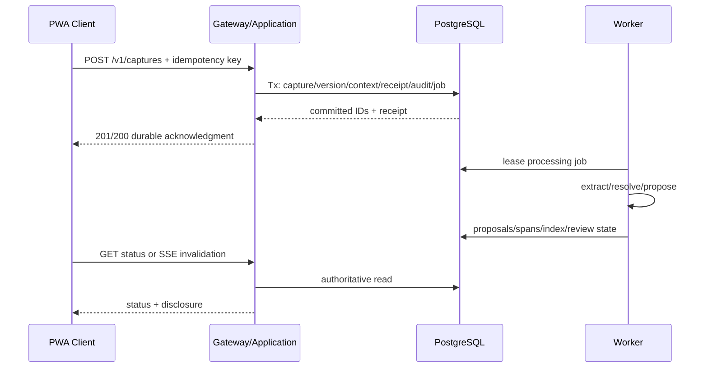

# Technical Architecture Recommendation

Package: `MYPA-QUICK-CAPTURE-FEATURE-PACKAGE-20260801-005`
Coordination request: `REQ-MYPA-QUICK-CAPTURE-FEATURE-DEFINITION-20260801-081`
Date: 2026-08-01
Repository basis: `RMF112018/my-pa@40391b784ba7df2aa37f99fed86b0d4ac4723034`
Status: `PROPOSED_FOR_OPERATOR_REVIEW`
Implementation authority: `NOT_GRANTED`
Repository mutation: `NOT_PERFORMED`


## Recommendation

Implement Quick Capture, when authorized, inside the existing **modular monolith**:

- gateway process for HTTP/PWA contracts;
- worker process for asynchronous processing;
- operator CLI/MCP only where a real use case exists;
- PostgreSQL for canonical capture, job, proposal, review, audit, receipt, and full-text-search state;
- one responsive PWA client;
- no new broker, cache, microservice, graph database, or dedicated vector database.

## Current repository dependency reality

Authenticated repository basis:

- source registry, bounded enrollment, PostgreSQL-backed application jobs, and read-only fixture provider exist at the current head;
- extraction, quarantine, coverage, and search are the next repository work package;
- public HTTP/MCP transport and full application services remain later;
- no frontend toolchain exists;
- frontend implementation is held by explicit operator direction until lifted.

Therefore, this package is implementation-aligned but **not an assertion of readiness**.

## Component responsibilities

### PWA/client

Owns:

- minimal capture UI;
- draft autosave;
- offline encrypted queue;
- client IDs/idempotency;
- launch context;
- network/sync state;
- generated typed client;
- accessibility;
- safe local telemetry.

Does not own:

- authorization;
- canonical lifecycle;
- entity resolution truth;
- review/promotion;
- cloud eligibility;
- downstream actions.

### Gateway/application

Owns:

- authentication/principal/purpose;
- request normalization and limits;
- idempotent create/version/read/list/search;
- classification and policy;
- deterministic context validation;
- capture transaction;
- response/disclosure envelope;
- review commands;
- SSE/poll status;
- audit/receipts.

### PostgreSQL

Owns canonical:

- captures/versions;
- links;
- conversations;
- proposals/spans;
- jobs/attempts;
- review cases;
- audit/receipts;
- search text/index;
- idempotency results.

Use Alembic for schema changes. Use PostgreSQL FTS first. Use `SELECT … FOR UPDATE SKIP LOCKED` job leasing consistent with the repository pattern.

### Worker

Owns:

- stage execution;
- normalization/mapping;
- deterministic extraction;
- model gateway calls;
- entity/context resolution;
- proposal/spans;
- contradiction/related records;
- search indexing;
- review routing;
- retry/quarantine.

### Model gateway/policy

A model adapter is a bounded infrastructure implementation behind application ports. It receives an explicit context manifest and no tool authority.

### Attachment storage

Deferred. If later required, use a managed content store separate from original external sources. Capture text remains in PostgreSQL and authoritative for typed MVP.

## Write flow



## Offline flow

```text
PWA → encrypted IndexedDB append
    → foreground/resume sync
    → idempotent server create
    → verified receipt
    → local ciphertext cleanup
```

Background Sync is an optimization, not the correctness mechanism.

## Status updates

Preferred:

- SSE for invalidation/status events when the gateway exists;
- polling fallback;
- clients refetch authoritative state after event;
- no WebSocket requirement.

Events contain opaque IDs and safe state changes, not note text.

## API transport

HTTP is primary for PWA. MCP may expose bounded capture operations later only if it adds a current local-agent use case and preserves the same policy/idempotency/authority semantics. MCP is not required for the user-facing MVP.

## Security boundaries

- same-origin protected deployment where practical;
- secure HTTP-only session or reviewed equivalent;
- CSRF protection for cookie-authenticated writes;
- no token in localStorage;
- source text excluded from logs/traces;
- strict Content Security Policy;
- untrusted text isolated from instructions;
- no direct browser/database/provider/model tool access;
- encrypted local queue;
- bounded payloads and rate limits;
- audit of denied processing and consequential transitions.

## Native-wrapper boundary

### Tauri evaluation trigger

Evaluate only if measurements show material unmet need for:

- system-wide hotkey;
- menu bar/system tray;
- launch-at-login;
- always-on-top window;
- stronger OS key storage;
- share extension/integration.

A wrapper must consume the same HTTP contracts and not embed alternative business logic or database access.

### Electron

Not preferred for initial evaluation because Quick Capture does not presently require Electron-specific ecosystem capabilities. It remains a fallback if a future requirement cannot be met safely/proportionately by Tauri/native/PWA.

### Native Apple app

Required for first-class App Intents, WidgetKit controls, Lock Screen/Control Center actions, and Share extension. It is a later platform workstream, not an MVP prerequisite.

## Explicitly rejected architecture

- Quick Capture microservice;
- Redis/Celery solely for capture;
- separate capture database;
- graph database for links;
- dedicated vector store for semantic search;
- local SQLite server-side store beside PostgreSQL;
- direct PWA access to PostgreSQL;
- native clients before PWA validation;
- generic plugin framework;
- automatic action agent.
